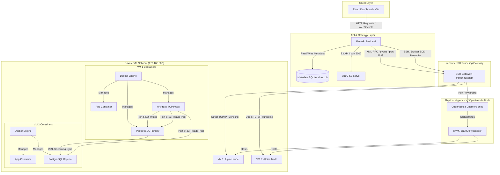
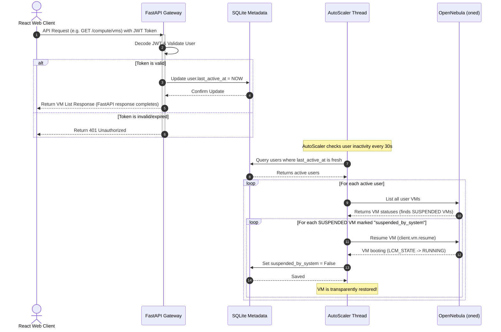
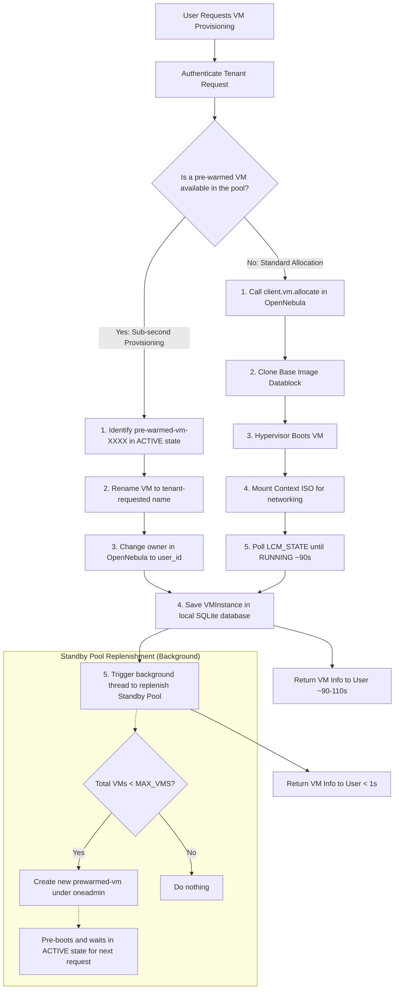
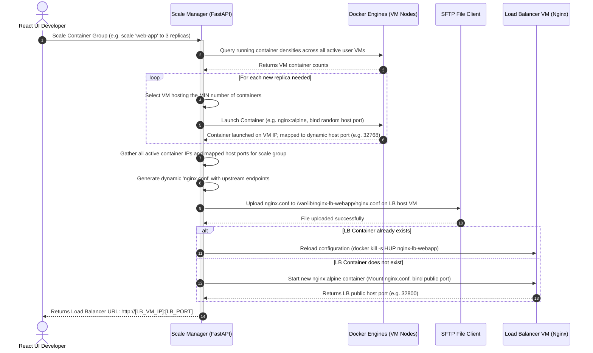
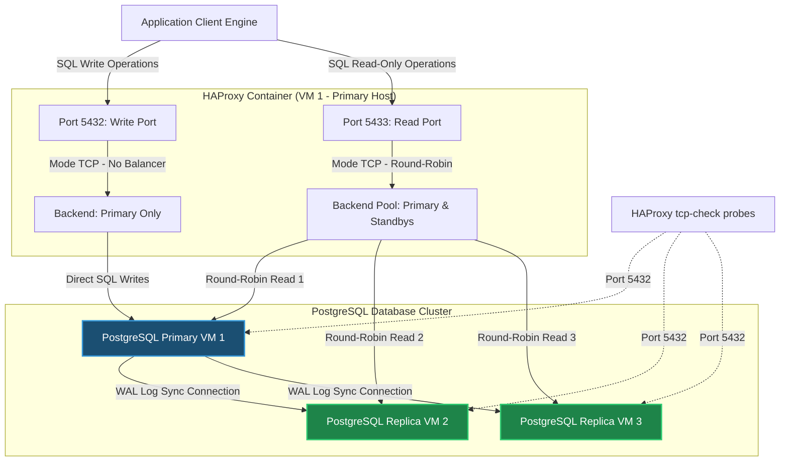
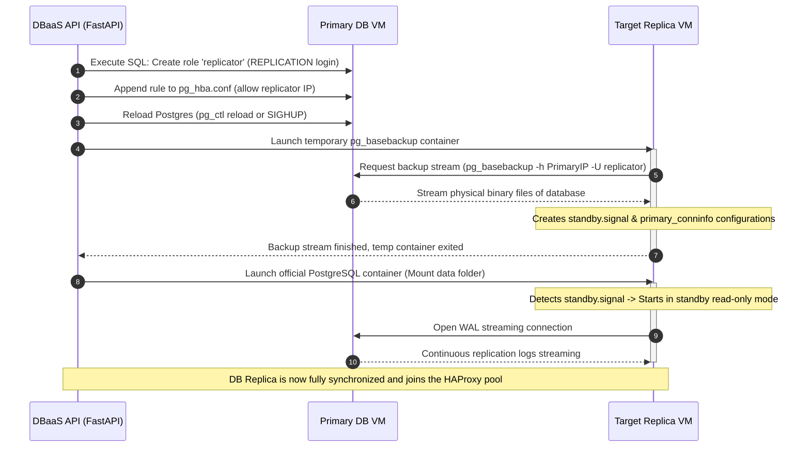

# Cloud Infrastructure Architecture & Flowcharts

This document provides a comprehensive architectural breakdown of the **My Own Cloud for Large Scale Data Science** platform, a custom Infrastructure-as-a-Service (IaaS) and Platform-as-a-Service (PaaS) cloud manager built on top of **OpenNebula 7.2.0**.

---

## 1. High-Level System Architecture

The platform follows a decoupled, stateless design. Local state and user metadata are stored in a SQLite database (`cloud.db`), while physical and container resources are queried dynamically from the virtual machines and OpenNebula controller.

The architecture comprises the following key components:

1.  **Frontend Dashboard (React/Vite):** The user-facing management dashboard.
2.  **API Gateway (FastAPI):** A high-performance REST API handling user requests, token validation, scheduling, and orchestrating downstream services.
3.  **Metadata Store (SQLite + SQLAlchemy):** Tracks tenant accounts, VM ownership mappings, custom disk definitions, and database cluster credentials.
4.  **OpenNebula Controller (`oned` XML-RPC daemon):** Manages hypervisor resources, KVM guest instances, virtual networks, and block storage datablocks.
5.  **SSH Gateway (`PonchaLaptop`):** Bridges local dev environments to the private VM networks and proxies WebSocket terminal sessions.
6.  **Object Storage (MinIO):** Provides tenant-isolated S3-compatible bucket storage.
7.  **Container & DBaaS Layer (Docker + PostgreSQL):** Exposes on-demand application container groups and replication-enabled PostgreSQL database clusters.

### High-Level System Architecture Diagram

---

## 2. Core Subsystems

### 2.1 Authentication & User Management
*   **Decoupled Syncing:** User accounts are registered in the local SQLite database (storing bcrypt-hashed passwords). Simultaneously, the API invokes OpenNebula's RPC to allocate a mirroring user (`client.user.allocate`).
*   **JWT & Transparent Activity Tracker:** When a user invokes any protected endpoint, the `get_current_user` FastAPI dependency intercepts the request, verifies the JWT token, and updates `user.last_active_at` in the SQLite database. This timestamp is used by the autoscaler to determine VM idle states.

### 2.2 Elastic Compute (VM Management)
*   **Pre-Warmed Standby Pool:** Cold booting a KVM/QEMU VM takes 85–110 seconds. To bypass this, the `AutoScaler` maintains a standby pool containing pre-booted, context-configured VMs (`prewarmed-vm-`) owned by the system admin. When a scale-up is triggered, the system claims a standby VM, renames it, and changes its ownership via the RPC API (`chown`), provisioning a working VM in **under 1 second**.
*   **Power-Saving / Scale-to-Zero:** To save hypervisor energy, the `AutoScaler` monitors user activity. If `last_active_at` exceeds 2 hours, all VMs belonging to that user are automatically suspended (`poweroff-hard`). When the user logs back in or calls any API endpoint, the request updates their activity status, prompting the API to resume their suspended VMs transparently.
*   **SSH Terminal WebSocket Bridge:** Users can access a VM shell directly from the web dashboard. The API opens a WebSocket, initializes a Paramiko SSH client, connects to the SSH Gateway, creates a `direct-tcpip` channel to the VM's internal port `22`, invokes an interactive shell, and pipes standard input/output bi-directionally.

### 2.3 Storage (Block & S3 Object Storage)
*   **Block Storage:** Users can provision custom empty datablocks in OpenNebula. These datablocks can be hot-plug attached to running VMs. The backend connects to the VM via SSH, formats the new disk (`mkfs.ext4 /dev/vdb`), mounts it, and adds an entry to `/etc/fstab` for boot persistence.
*   **Object Storage:** A local MinIO service acts as an S3-compatible backend. Each tenant gets a separate bucket named `user-{username}` created automatically on their first upload, ensuring physical namespace isolation.

### 2.4 Container Orchestration & Scaling
*   **Stateless Label-Based Isolation:** Rather than tracking containers in SQLite, the API queries active Docker engines dynamically. Containers are tagged with metadata: `cloud_user=<username>` and `scale_group=<group_name>`. The API filters list and control operations using these labels, enforcing multi-tenant security.
*   **Placement Scheduler:** When a container scale-up is requested, the scheduler queries container densities across all active user VMs and deploys the container on the VM hosting the fewest containers.
*   **Dynamic Load Balancing (Nginx):** When a container group scales, the manager resolves all backend VM IPs and dynamic host ports, generates an Nginx configuration file (`nginx.conf`) with the upstream endpoints, SFTP-uploads it to the designated Load Balancer VM, and boots/reloads an Nginx proxy container.

### 2.5 Database-as-a-Service (DBaaS)
*   **Clustered Architecture:** PostgreSQL instances are provisioned inside Docker containers on separate VMs. The cluster consists of one Primary node (Read/Write) and one or more Read-only replicas.
*   **Synchronization (WAL Streaming):** Standby replicas are initialized by executing `pg_basebackup` inside a temporary container, cloning the Primary data directory over the network. Once initialized, the replica maintains a TCP connection to stream Write-Ahead Logs (WAL) in real-time.
*   **Layer 4 TCP Load Balancing (HAProxy):** An HAProxy container is deployed on the Primary VM. It listens on two ports:
    *   **Port 5432 (Write Frontend):** Forwards queries exclusively to the Primary.
    *   **Port 5433 (Read Frontend):** Balances queries round-robin across the Primary and all Standby replicas.
*   **Zero-Downtime Hot Reloads:** When a database replica scales, HAProxy's config is regenerated, uploaded, and hot-reloaded by sending a `SIGHUP` signal (`docker kill -s HUP <haproxy_container>`), ensuring active connections are not interrupted.

---

## 3. Detailed Architectural Flowcharts

### 3.1 User Request Auth & "Wake-on-API" VM Resume

This flowchart illustrates how standard API requests trigger the transparent wake-up of suspended user VMs.

---

### 3.2 VM Provisioning: Standby Pool vs. Cold Boot

This flowchart shows the difference between provisioning a VM from scratch (Cold Boot) and claiming a pre-warmed standby VM.

---

### 3.3 Container Scaling & Dynamic Nginx Load Balancing

This flowchart illustrates the scheduling of new container replicas and the hot reloading of the upstream Nginx load balancer configuration.

---

### 3.4 Database Cluster Architecture & HAProxy Routing

This diagram shows how database transactions are isolated and routed via HAProxy, as well as how Standby replicas synchronize with the Primary database.

---

### 3.5 Database Replication Setup & Synchronization Flow

This sequence diagram depicts the initialization of a PostgreSQL Read Replica using a temporary `pg_basebackup` container.

