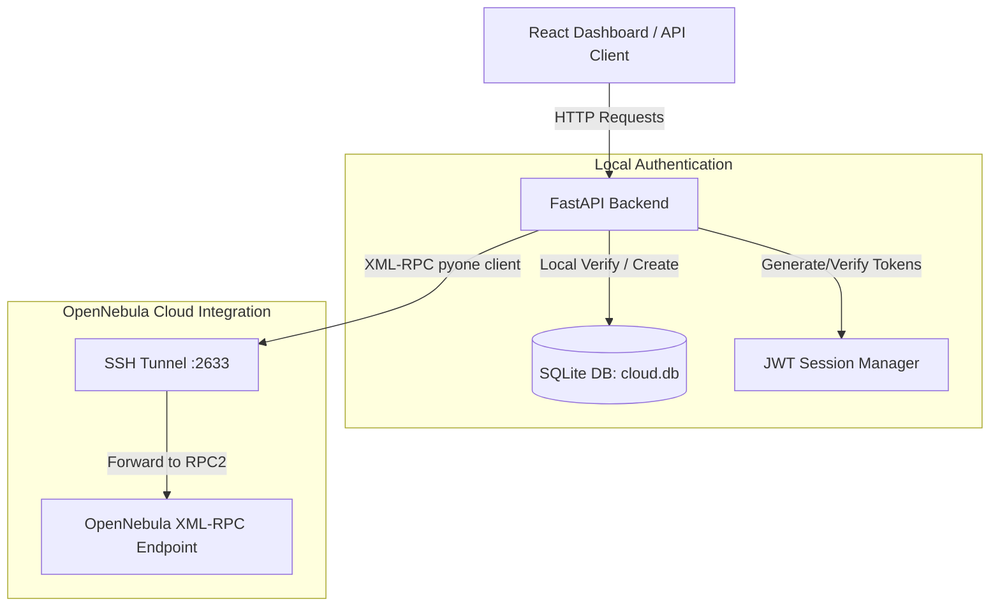
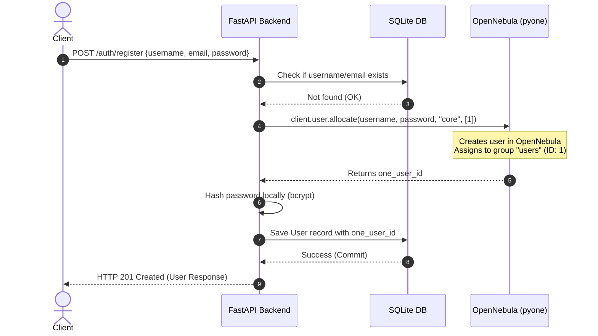
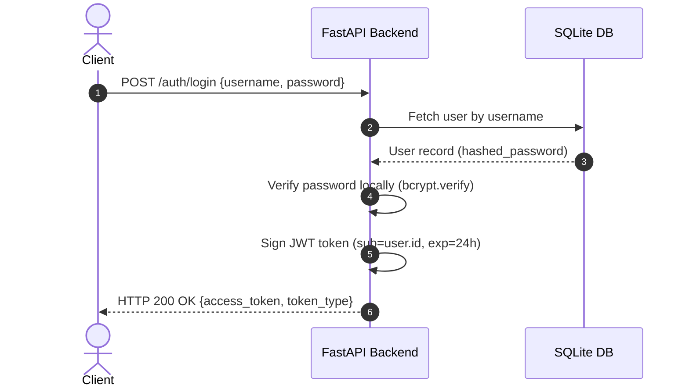
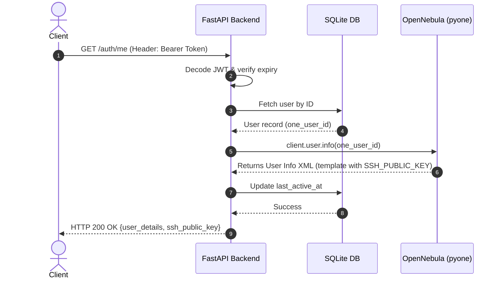
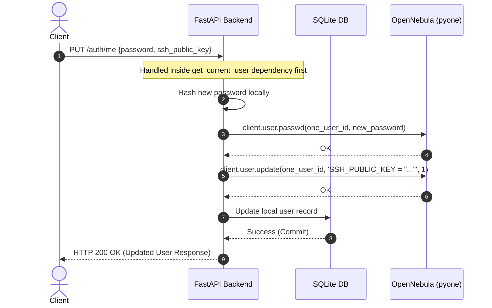

# User Authentication & OpenNebula Integration Guide

This guide describes the architecture, data models, API endpoints, and synchronization logic for **User Authentication and Management** in our custom Cloud Infrastructure. It explains how local accounts are managed and how actions are mirrored to **OpenNebula** using XML-RPC.

---

## 1. Architecture Overview

The authentication system employs a **dual-layer authentication model**:
1. **Local SQLite Database:** Stores user profiles, hashed credentials, configuration status, and OpenNebula mapping IDs.
2. **OpenNebula XML-RPC (via `pyone`):** Synchronizes user identity and templates on OpenNebula, which enables provisioning VMs, containers, and databases under the user's specific context.

### Authentication Topology



### High-Level Synchronization Rules
* **Local First for Validation:** Local lookups ensure that usernames and emails are unique and check login credentials instantaneously.
* **OpenNebula First for Creation/Deletion:** When registering or deleting a user, the operation is performed on OpenNebula **first**. If OpenNebula fails (e.g. timeout, duplicate username, connection error), the entire request fails, preventing inconsistent states in the local DB.
* **Local-Only Verification for Login:** Login verification is strictly local (using `bcrypt` checks). This eliminates the network latency of querying OpenNebula on every login request.

---

## 2. OpenNebula Connection Setup

The backend communicates with OpenNebula using the XML-RPC protocol. Since the XML-RPC daemon is bound to localhost on the cloud server, you must establish an **SSH Tunnel** before running the API:

```bash
ssh -L 2633:localhost:2633 ubuntu@[opennebula-ip]
```

### Connection Configuration
The OpenNebula client is initialized in [opennebula/connection.py](file:///Users/angiebras/Library/CloudStorage/OneDrive-Pessoal/Ambiente%20de%20Trabalho/Mestrado/2-SEMESTRE/CLOUD/CloudInfra/CloudInfrastructure/opennebula/connection.py):
* **Endpoint:** `http://localhost:2633/RPC2`
* **Credentials:** Loaded via `.env` files using standard syntax:
  ```env
  ONE_USER=oneadmin
  ONE_PASSWORD=your_password_here
  ```
* **Client Class:** The application calls `get_client()` to obtain an authenticated instance of `pyone.OneServer`.

---

## 3. Database Schema

The local `users` table is defined in [api/auth/models.py](file:///Users/angiebras/Library/CloudStorage/OneDrive-Pessoal/Ambiente%20de%20Trabalho/Mestrado/2-SEMESTRE/CLOUD/CloudInfra/CloudInfrastructure/api/auth/models.py). It holds user configuration and keeps track of their mapping to OpenNebula.

| Column | Type | Constraints | Description |
| :--- | :--- | :--- | :--- |
| `id` | `Integer` | Primary Key, Index | Unique local identifier |
| `username` | `String` | Unique, Index, Not Null | Chosen login username (mirrored to OpenNebula) |
| `email` | `String` | Unique, Index, Not Null | Contact email address |
| `hashed_password`| `String` | Not Null | Password hashed locally with `bcrypt` |
| `is_active` | `Boolean` | Default: `True` | Account state (disabled accounts are blocked) |
| `is_admin` | `Boolean` | Default: `False` | Administrative privileges flag |
| `one_user_id` | `Integer` | Nullable | **Mapping Key:** The numeric user ID returned by OpenNebula |
| `created_at` | `DateTime`| Server Default: `now()` | Local registration timestamp |
| `last_active_at` | `DateTime`| Server Default: `now()` | Timestamp of the user's last API access |

---

## 4. Authentication API Endpoints

All authentication endpoints are prefixed with `/auth` and declared in [api/auth/router.py](file:///Users/angiebras/Library/CloudStorage/OneDrive-Pessoal/Ambiente%20de%20Trabalho/Mestrado/2-SEMESTRE/CLOUD/CloudInfra/CloudInfrastructure/api/auth/router.py).

| Method | Endpoint | Authorization | Description |
| :--- | :--- | :--- | :--- |
| **POST** | `/auth/register` | Public | Register a new user, allocate an OpenNebula user, and save details locally |
| **POST** | `/auth/login` | Public | Verify credentials and issue a JWT access token |
| **GET** | `/auth/me` | JWT Token | Retrieve details of the current logged-in user (includes SSH key from OpenNebula) |
| **PUT** | `/auth/me` | JWT Token | Update user email, local/OpenNebula password, or SSH public key |
| **DELETE**| `/auth/me` | JWT Token | Delete the account locally and from the OpenNebula system |

---

## 5. Detailed Step-by-Step Flows

### A. User Registration (`/auth/register`)

When a user registers:
1. **Local Checks:** The backend validates that the requested `username` and `email` are not already in use in the local SQLite database.
2. **OpenNebula Allocation:**
   * The password is encrypted/hashed locally using `bcrypt` (via `passlib.context.CryptContext`).
   * The backend invokes `create_one_user(username, password)` in [api/auth/opennebula_sync.py](file:///Users/angiebras/Library/CloudStorage/OneDrive-Pessoal/Ambiente%20de%20Trabalho/Mestrado/2-SEMESTRE/CLOUD/CloudInfra/CloudInfrastructure/api/auth/opennebula_sync.py).
   * This executes the XML-RPC method `client.user.allocate(username, password, "core", [1])`.
     * `"core"` signifies OpenNebula's built-in authentication driver.
     * `[1]` places the new user in the standard `users` group (Group ID 1), which has unprivileged user rights.
   * If successful, OpenNebula returns a unique numeric User ID (`one_user_id`).
3. **Local Write:** The user is added to the SQLite database with the hashed password and `one_user_id`. The transaction is committed.



### B. User Login (`/auth/login`)

The login process is kept highly performant by avoiding external network hops to the OpenNebula service:
1. The client sends a `POST /auth/login` request with the `username` and `password`.
2. The backend queries SQLite for the user record matching the `username`.
3. If the user is found, the backend verifies the plaintext password against the `hashed_password` using `pwd_context.verify(...)`.
4. If valid, the backend issues a JWT Access Token.
   * **Algorithm:** HS256
   * **Subject (`sub`):** The local User ID (`id`)
   * **Expiration (`exp`):** 24 Hours
   * **Key:** `SECRET_KEY` (configured locally or via env)



### C. Profile Retreival & SSH Key Sync (`GET /auth/me`)

The JWT token is validated on each secure endpoint via the `get_current_user` dependency in [api/auth/jwt.py](file:///Users/angiebras/Library/CloudStorage/OneDrive-Pessoal/Ambiente%20de%20Trabalho/Mestrado/2-SEMESTRE/CLOUD/CloudInfra/CloudInfrastructure/api/auth/jwt.py).
1. The backend decodes the token, checks the expiration, and queries the local database to find the user.
2. It then calls `get_one_user_ssh_key(one_user_id)` to retrieve user templates dynamically from OpenNebula:
   * Runs `client.user.info(one_user_id)`.
   * Checks the user's OpenNebula template dictionary for the `SSH_PUBLIC_KEY` variable.
3. The response combines local attributes with the dynamically fetched SSH public key.



### D. Updating Profile (`PUT /auth/me`)

Users can update their email, password, and SSH key.
* **Password Updates:** If updated, the password is re-hashed locally and immediately mirrored to OpenNebula by invoking `client.user.passwd(one_user_id, new_password)`.
* **SSH Key Updates:** OpenNebula handles user templates that carry contextual information. When a user changes their SSH public key:
  1. The API formats the key into an OpenNebula template string: `SSH_PUBLIC_KEY = "<ssh_key_content>"`.
  2. The API calls `client.user.update(one_user_id, template_str, 1)`.
  3. The argument `1` represents **MERGE**, which ensures that only the `SSH_PUBLIC_KEY` property is written or updated without destroying other existing metadata in the OpenNebula template.
  4. Any future VMs launched by this user will automatically have this SSH key injected, permitting secure shell access.



### E. Account Deletion (`DELETE /auth/me`)

To delete an account:
1. The backend first removes the user from OpenNebula:
   * Calls `delete_one_user(one_user_id)` which runs `client.user.delete(one_user_id)`.
2. The backend then deletes the local user row from the SQLite database and commits.
3. This sequence guarantees that no orphaned users are left in the OpenNebula user list if the local deletion fails, and vice versa.
