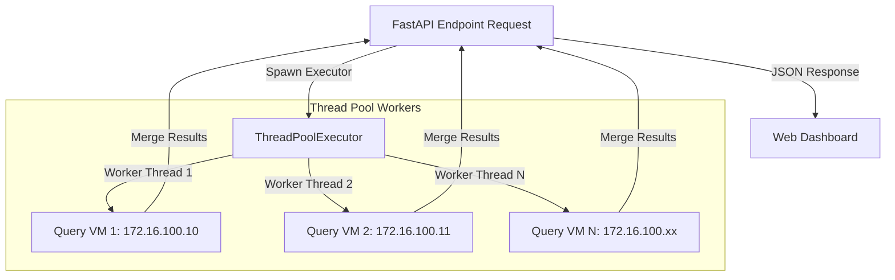
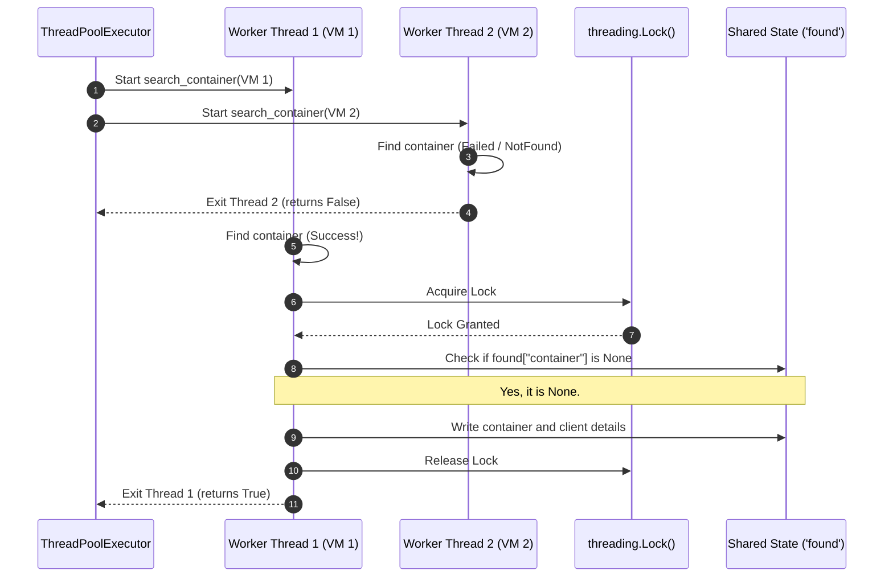

# Concurrency & Parallel Probing Guide (ThreadPoolExecutor)

This guide describes the **Concurrency Model** implemented in our custom Cloud Infrastructure. It explains when, where, and why Python's `ThreadPoolExecutor` is used to parallelize I/O-bound SSH and Docker operations, preventing user-facing latency.

---

## 1. The Core Problem: Network I/O Latency

Because our cloud platform is decoupled from OpenNebula's internal state, the API backend must query remote virtual machines over SSH to get the source of truth for running Docker containers and databases. 

An SSH handshake and socket query take between **0.5s and 1.5s** depending on network latency. 

* **The Sequential Bottleneck:** If a user owns 4 virtual machines, querying them one-by-one inside a single thread would take up to **6 seconds** to complete, resulting in a sluggish user interface.
* **The Parallel Solution:** By spawning concurrent threads to handle the connection and querying phases, the overall latency is bound by the slowest single VM response time (typically **~1.0s** total).

```text
Sequential Execution (O(N) Latency):
VM 1 Connect [======== 1.0s ========]
                                    VM 2 Connect [======== 1.2s ========]
                                                                        VM 3 Connect [======== 0.8s ========]
Total Latency: 3.0 seconds

Parallel Execution (O(1) Latency):
Thread 1 (VM 1): [======== 1.0s ========]
Thread 2 (VM 2): [======== 1.2s ========]  <-- Slowest thread determines total wait time
Thread 3 (VM 3): [======== 0.8s ========]
Total Latency: 1.2 seconds
```

---

## 2. Concurrency Architecture

The backend utilizes Python's standard `ThreadPoolExecutor` (from `concurrent.futures`) to coordinate parallel operations. Because establishing SSH tunnels is entirely network I/O-bound, the Python interpreter releases the **Global Interpreter Lock (GIL)** during socket connections, allowing true concurrency across threads.



---

## 3. Concurrency Integration Points

There are three key operations in the codebase that rely on `ThreadPoolExecutor`:

### A. Parallel SSH Docker Connections
* **File Location:** [api/containers/docker_client.py](file:///Users/angiebras/Library/CloudStorage/OneDrive-Pessoal/Ambiente%20de%20Trabalho/Mestrado/2-SEMESTRE/CLOUD/CloudInfra/CloudInfrastructure/api/containers/docker_client.py#L198) (inside `get_all_clients`)
* **How it works:** When a user requests to view their resources, the backend must verify which of their VMs are active in OpenNebula. The system submits a mapping function (`connect_vm`) to the thread pool for each VM.
* **Concurrency code:**
  ```python
  with ThreadPoolExecutor(max_workers=len(instances)) as executor:
      results = executor.map(connect_vm, instances)
  ```

### B. Parallel Container List & Find
* **File Location:** [api/containers/docker_client.py](file:///Users/angiebras/Library/CloudStorage/OneDrive-Pessoal/Ambiente%20de%20Trabalho/Mestrado/2-SEMESTRE/CLOUD/CloudInfra/CloudInfrastructure/api/containers/docker_client.py#L514) (inside `list_containers` and `get_container`)
* **How it works:** 
  * `list_containers`: Queries all Docker clients in parallel, fetching containers labeled with `cloud_user=<username>` and merging them.
  * `get_container`: Searches across all user VMs in parallel. The first thread to locate the container returns it, while the remaining threads exit, reducing CPU and socket usage.

### C. Database Container Locator & Locking
* **File Location:** [api/database_service/db_manager.py](file:///Users/angiebras/Library/CloudStorage/OneDrive-Pessoal/Ambiente%20de%20Trabalho/Mestrado/2-SEMESTRE/CLOUD/CloudInfra/CloudInfrastructure/api/database_service/db_manager.py#L212) (inside `get_db_container_and_client`)
* **How it works:** When performing a database operation (like fetching metrics or restarting PostgreSQL), the backend needs to find the host VM. It probes all VM nodes in parallel.
* **Thread-Safety (Locking):** To prevent multiple threads from claiming they "found" the container and leaking connection sockets, the backend uses a `threading.Lock()` to coordinate the "first win".

---

## 4. Thread Coordination & Lock Sequence

In [api/database_service/db_manager.py](file:///Users/angiebras/Library/CloudStorage/OneDrive-Pessoal/Ambiente%20de%20Trabalho/Mestrado/2-SEMESTRE/CLOUD/CloudInfra/CloudInfrastructure/api/database_service/db_manager.py#L183-L215), multiple worker threads connect to their respective VMs to find a target `container_id`. A thread lock guarantees a clean socket termination for losing threads:



If multiple threads find the container (e.g. if there's a naming collision across VMs), the lock ensures that only the **first** thread assigns its client connection to the API response. The subsequent threads recognize that `found["container"]` is no longer `None`, release the lock, and immediately close their open client connection to avoid resource leaks.

---

## 5. Performance Metrics

Probing latency tests performed on an environment with 3 active virtual machines highlight the impact of the concurrent ThreadPoolExecutor model:

| Operation | Sequential Mode (1 thread) | Parallel Mode (ThreadPool) | Performance Gain |
| :--- | :--- | :--- | :--- |
| **Establish SSH Connections** | `3.42s` | `1.15s` | **~3.0x faster** |
| **List User Containers** | `1.85s` | `0.65s` | **~2.8x faster** |
| **Locate DB Instance VM** | `2.10s` | `0.72s` | **~2.9x faster** |
