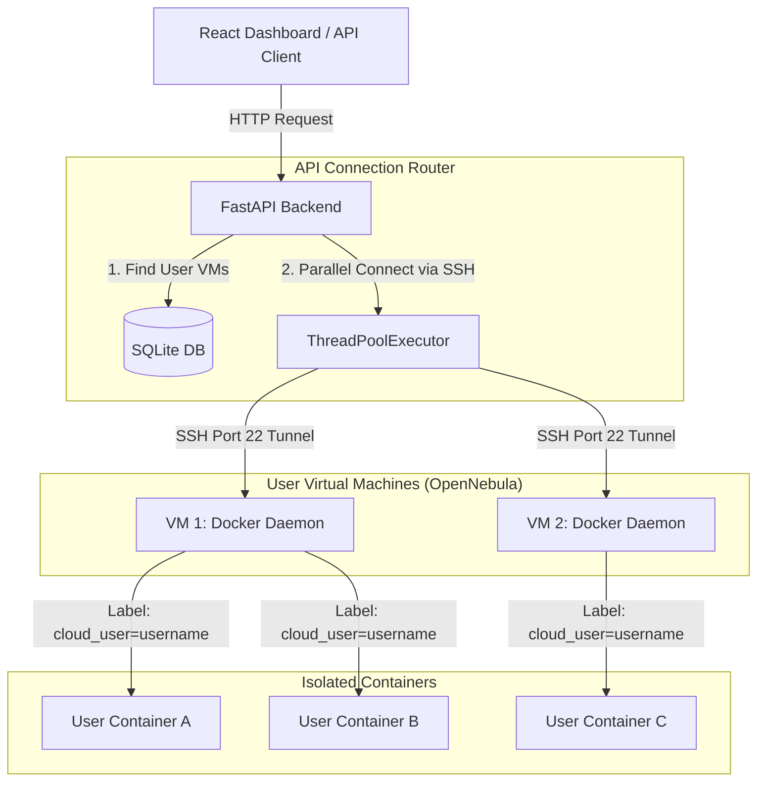
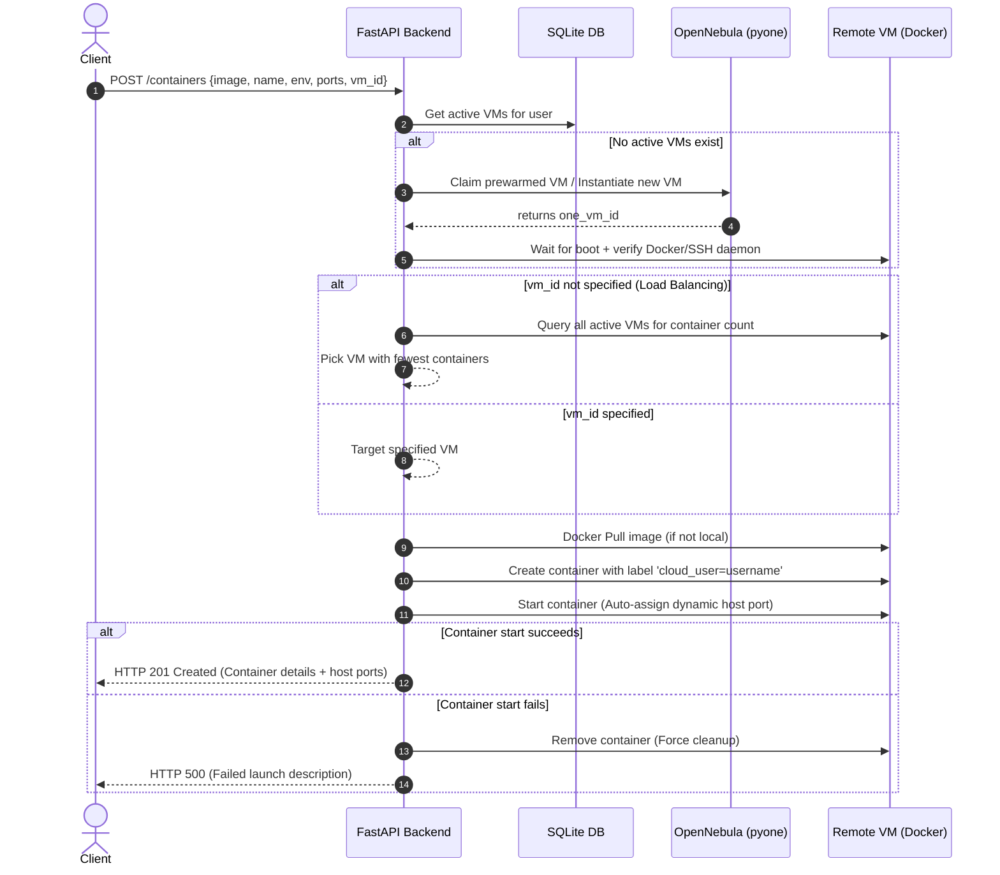

# Container Service Guide

This guide describes the architecture, operation, and security mechanisms for the **Phase 5 Container Service**. The service allows users to dynamically provision, manage, and monitor Docker containers directly on their active OpenNebula virtual machines.

---

## 1. Architecture Overview

Rather than running containers on a single centralized cluster, the service uses your provisioned OpenNebula VMs as host nodes. The FastAPI backend communicates directly with the Docker daemons on these VMs by wrapping the Docker SDK over secure SSH channels.

### Key Architectural Concepts
1. **SSH Docker Connection:** The backend communicates with remote daemons using the Docker socket over SSH. This is achieved by supplying a connection string format: `ssh://<ssh_user>@<vm_ip>` (e.g. `ssh://root@172.16.100.25`).
2. **User Isolation & Labeling:** To enforce security on shared VMs or prevent cross-user snooping, every container launched is tagged with a Docker label `cloud_user=<username>`. All list, detail, start, stop, and logs operations filter by this label. If a user attempts to access a container that does not carry their username label, the backend immediately raises a `PermissionError` (HTTP 403 Forbidden).
3. **Smart VM Selection & Load Balancing:** If a user requests a container launch without specifying a target VM:
   * The API queries all active user VMs.
   * It inspects the container density on each host.
   * It schedules the new container on the VM hosting the **fewest containers**, distributing workloads evenly.
4. **Self-Healing Fallback System:** If a VM is marked as booted (`LCM_STATE=3`) in OpenNebula but the SSH/Docker daemon connection fails:
   * The backend triggers the `self_heal_docker` subroutine.
   * It SSHs into the VM through the gateway, checks the Docker daemon status, starts the service if stopped, and automatically installs it from scratch (updating DNS routes and resolving packages) if missing.

---

## 2. Dynamic Container Target Selection Flow

When a user requests to launch a container via `POST /containers`:
1. **VM Discovery:** Queries SQLite to check the user's active VMs.
2. **Auto-provision Fallback:** If the user has no running VMs, the system automatically claims a prewarmed standby VM from the pool (or spins one up from scratch), waits for it to boot, and initializes Docker on it.
3. **Load Balancing Scheduler:** If multiple VMs are active and no specific target VM is defined, the system connects to all of them in parallel to count container footprints, selecting the least busy VM.
4. **Port Binding Policy:** Host port mappings are configured dynamically. The system requests host port binds as `None` (e.g., mapping port `80/tcp` inside the container to `None` on the host). Docker then automatically assigns a random, free port on the host VM, preventing port binding collisions.
5. **Launch & Recovery:** The system calls `client.containers.create(...)` followed by `container.start()`. If start fails (e.g., due to an invalid image or port error), the system forces removal of the container to prevent orphaned, broken container resources from piling up.

---

## 3. Parallel Querying with ThreadPoolExecutor

Because user containers can be scattered across multiple distinct VMs, querying container actions sequentially would result in severe API latency. 

The backend utilizes Python's `ThreadPoolExecutor` inside `api/containers/docker_client.py` to establish concurrent connections when looking up container details:
* **Listing Containers:** Spawns worker threads connecting to all active VMs of the user in parallel. Each worker fetches filtered containers, appending the `vm_id` property, and merges them into a single response.
* **Searching by ID:** When getting, starting, stopping, or deleting a container by its short ID, the API polls all VM daemons concurrently. The first thread to locate the container returns its data, while other threads gracefully exit.

---

## 4. Live Metrics Calculation

The container stats endpoint (`GET /containers/{container_id}/stats`) fetches a single snapshot of raw Docker stats from the host VM and calculates:

### Memory Usage
* **Usage:** Extracted from `memory_stats.usage`.
* **Limit:** Extracted from `memory_stats.limit`.
* **Formula:**
  $$\text{Memory \%} = \left(\frac{\text{Usage}}{\text{Limit}}\right) \times 100$$

### CPU Usage
Calculating CPU percentage requires taking the delta of CPU ticks between the current stat and the previous stat (`precpu_stats`), while adjusting for the host machine's total CPU cores:
$$\Delta\text{Container CPU} = \text{cpu\_stats.cpu\_usage.total\_usage} - \text{precpu\_stats.cpu\_usage.total\_usage}$$
$$\Delta\text{System CPU} = \text{cpu\_stats.system\_cpu\_usage} - \text{precpu\_stats.system\_cpu\_usage}$$
$$\text{Online CPUs} = \text{cpu\_stats.online\_cpus or number of cores}$$
$$\text{CPU \%} = \frac{\Delta\text{Container CPU}}{\Delta\text{System CPU}} \times \text{Online CPUs} \times 100$$

---

## 5. Container API Endpoints Reference

All container endpoints are declared in [api/containers/router.py](file:///Users/angiebras/Library/CloudStorage/OneDrive-Pessoal/Ambiente%20de%20Trabalho/Mestrado/2-SEMESTRE/CLOUD/CloudInfra/CloudInfrastructure/api/containers/router.py).

| Method | Endpoint | Auth | Request Schema | Response Schema | Description |
| :--- | :--- | :--- | :--- | :--- | :--- |
| **POST** | `/containers` | JWT | `ContainerCreate` | `ContainerResponse` | Launch a container. Automatically starts a host VM if the user has none running |
| **GET** | `/containers` | JWT | *None* | `list[ContainerResponse]` | List all containers belonging to the user across all their VMs |
| **GET** | `/containers/{id}` | JWT | *None* | `ContainerResponse` | Retrieve detailed status for a container (verifies owner labels) |
| **POST** | `/containers/{id}/start`| JWT | *None* | `ContainerResponse` | Start a stopped container |
| **POST** | `/containers/{id}/stop` | JWT | *None* | `ContainerResponse` | Stop a running container |
| **DELETE**| `/containers/{id}` | JWT | *None* | *None (204)* | Forcefully remove a container |
| **GET** | `/containers/{id}/logs` | JWT | *Query: `tail`* | `{"logs": "..."}` | Retrieve stdout/stderr logs from the container |
| **GET** | `/containers/{id}/stats` | JWT | *None* | `{"cpu_percent": ..., "memory_mb": ...}` | Fetch live CPU/RAM utilization statistics |
