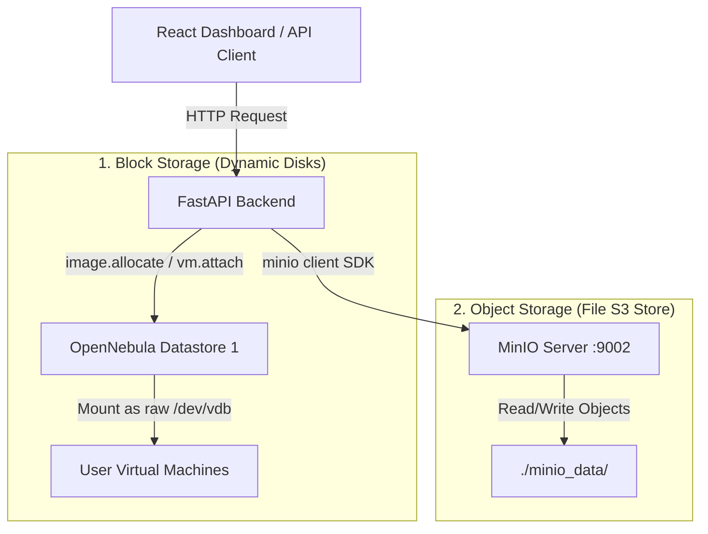
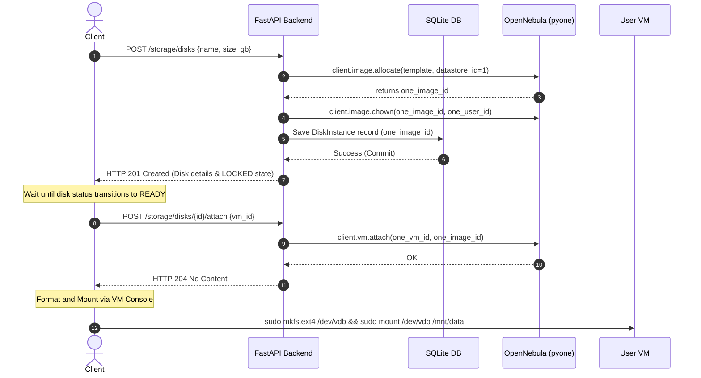
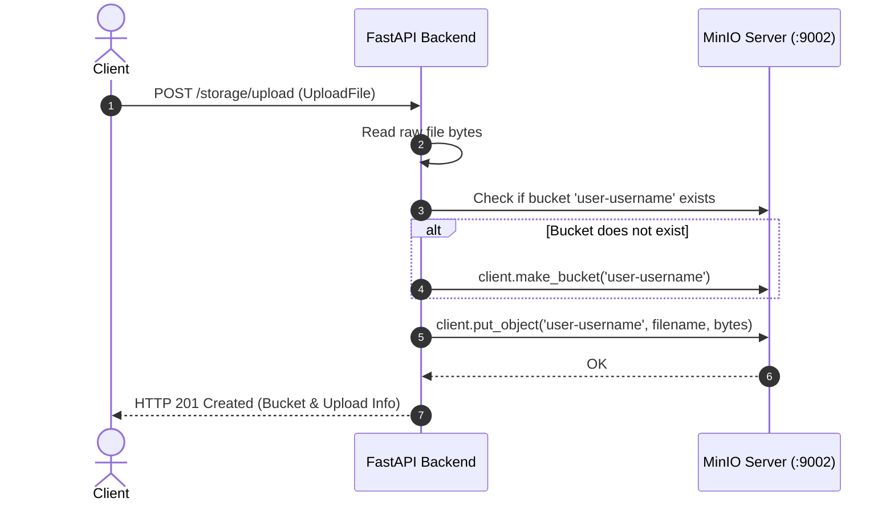

# Block Storage & Object Storage Guide

This guide describes how to manage and verify both **Block Storage (Dynamic Disk Volumes)** and **Object Storage (MinIO File Store)** in our custom cloud platform. 

---

## 1. Architecture Overview

Our platform provides two independent tiers of persistent storage:



### Storage Tiers Comparison:
*   **Block Storage:** Provides raw, unformatted persistent block devices (equivalent to AWS EBS or Google Persistent Disks). They exist independently of the VMs, meaning they survive VM termination. They must be formatted (e.g. `ext4`) and mounted before use.
*   **Object Storage:** Provides an S3-compatible HTTP object store (powered by MinIO). It is ideal for storing unstructured files (images, datasets, backup dumps). Each user's files are isolated inside their own private bucket.

---

## 2. Block Storage (Disks) Architecture

### A. Lifecycle & Operations
1. **Disk Creation (`POST /storage/disks`):** The API calls `client.image.allocate(...)` in OpenNebula to provision an empty `DATABLOCK` image in Datastore 1. It then changes ownership (`client.image.chown`) to the user's OpenNebula ID. A corresponding metadata row is saved in the local SQLite DB.
2. **Disk Attachment (`POST /storage/disks/{id}/attach`):** Triggers `client.vm.attach` in OpenNebula. The hypervisor dynamically attaches the disk datablock to the running VM.
3. **Format & Mount:** The user opens the VM's SSH terminal, creates a filesystem (like `ext4`), and mounts the device.
4. **Disk Detachment (`POST /storage/disks/{id}/detach`):** Performs `client.vm.detach` in OpenNebula to safely release the disk block from the VM, returning the image status to `READY`.



### B. Database Schema (`disk_instances` table)
Defined in [api/storage/models.py](file:///Users/angiebras/Library/CloudStorage/OneDrive-Pessoal/Ambiente%20de%20Trabalho/Mestrado/2-SEMESTRE/CLOUD/CloudInfra/CloudInfrastructure/api/storage/models.py):
*   **`id`**: Local unique ID.
*   **`user_id`**: Foreign Key referencing the owner `User.id`.
*   **`one_image_id`**: **Mapping Key:** The unique Image ID assigned by OpenNebula.
*   **`name`**: User-defined volume name.
*   **`size_gb`**: Disk capacity in Gigabytes.
*   **`created_at`**: Creation timestamp.

### C. Formatting and Mounting inside the VM
Because block devices are attached as raw drives (e.g. `/dev/vdb` or `/dev/sdb`), you must write a filesystem to them and mount them:

1. **Open VM Terminal:** Open the Web SSH Console next to your VM on the dashboard.
2. **Identify the Disk Device:** Run `lsblk` to list block devices. Locate the disk matching your size (typically `/dev/vdb` or `/dev/sdb`).
3. **Format the Disk (Once Only!):**
   ```bash
   sudo mkfs.ext4 /dev/vdb
   ```
   > [!WARNING]
   > Only format the disk **the first time** you initialize it. Formatting an existing disk will permanently delete all stored data.
4. **Mount the Disk:**
   ```bash
   sudo mkdir -p /mnt/my-data
   sudo mount /dev/vdb /mnt/my-data
   sudo chmod -R 777 /mnt/my-data
   ```
5. **Enable Mounting on Boot:**
   Find the disk UUID using `sudo blkid /dev/vdb`. Open `/etc/fstab` and append:
   ```text
   UUID=YOUR-DISK-UUID-HERE  /mnt/my-data  ext4  defaults,nofail  0  2
   ```

---

## 3. Object Storage (MinIO) Architecture

### A. Lifecycle & Operations
*   **Bucket Isolation:** Each user's objects are isolated inside a dedicated S3 bucket named `user-{username}`. 
*   **Auto-Provisioning:** The bucket is automatically checked and created using `ensure_bucket` on the user's first upload or list action.
*   **S3 Client Connection:** Handled in [api/storage/minio_client.py](file:///Users/angiebras/Library/CloudStorage/OneDrive-Pessoal/Ambiente%20de%20Trabalho/Mestrado/2-SEMESTRE/CLOUD/CloudInfra/CloudInfrastructure/api/storage/minio_client.py) using the standard `Minio` SDK client pointing to the environment-configured endpoint (default: `localhost:9002`).



---

## 4. Storage API Endpoints Reference

All storage endpoints are declared in [api/storage/router.py](file:///Users/angiebras/Library/CloudStorage/OneDrive-Pessoal/Ambiente%20de%20Trabalho/Mestrado/2-SEMESTRE/CLOUD/CloudInfra/CloudInfrastructure/api/storage/router.py).

### Block Storage (Disks)

| Method | Endpoint | Auth | Request Body | Description |
| :--- | :--- | :--- | :--- | :--- |
| **POST** | `/storage/disks` | JWT | `{ "name": "disk-name", "size_gb": 10 }` | Create an empty disk volume in OpenNebula |
| **GET** | `/storage/disks` | JWT | *None* | List all user disks, showing live OpenNebula statuses & VM attachments |
| **DELETE**| `/storage/disks/{id}` | JWT | *None* | Permanently delete a disk (must be detached and unlocked first) |
| **POST** | `/storage/disks/{id}/attach`| JWT | `{ "vm_id": 12 }` | Attach the disk to the target VM |
| **POST** | `/storage/disks/{id}/detach`| JWT | *None* | Detach the disk from the VM |

### Object Storage (Files)

| Method | Endpoint | Auth | Request Body / Param | Description |
| :--- | :--- | :--- | :--- | :--- |
| **POST** | `/storage/upload` | JWT | Form-data: `file` | Upload a file to the user's private MinIO bucket |
| **GET** | `/storage/files` | JWT | *None* | List all metadata (filename, size, last modified) for user's files |
| **GET** | `/storage/download/{name}`| JWT | Path parameter: `filename` | Download the raw file bytes (returns attachment headers) |
| **DELETE**| `/storage/files/{name}` | JWT | Path parameter: `filename` | Delete a file from the user's bucket |
