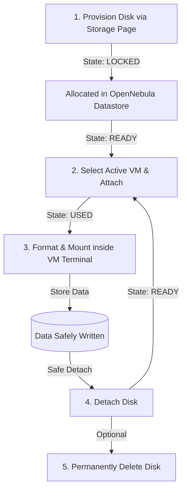

# Block Storage (Disk Management) — Operation & Testing Guide

This guide describes how to allocate, attach, manage, format, and mount **Block Storage Disk Volumes** in our custom cloud platform. 

Block Storage volumes act as raw, empty virtual hard drives (equivalent to AWS EBS or Google Persistent Disks). They exist independently of your Virtual Machines, meaning they persist even if the VM they are attached to is terminated.

---

## 1. Lifecycle Workflow



---

## 2. API Endpoints Reference

The Disk Management service exposes the following endpoints under `/storage/disks`:

| Method | Endpoint | Request Body | Description |
| :--- | :--- | :--- | :--- |
| **POST** | `/storage/disks` | `{ "name": "disk-1", "size_gb": 10 }` | Create an empty disk volume in OpenNebula (stored in Datastore 1) |
| **GET** | `/storage/disks` | *None* | List all disks owned by the user, including live status and VM attachments |
| **DELETE**| `/storage/disks/{id}` | *None* | Delete a disk (must be detached first) |
| **POST** | `/storage/disks/{id}/attach` | `{ "vm_id": 62 }` | Attach the disk to the target Virtual Machine |
| **POST** | `/storage/disks/{id}/detach` | *None* | Detach the disk from whichever Virtual Machine it is attached to |

---

## 3. Formatting and Mounting inside the VM

Because block devices are attached as raw drives (e.g. `/dev/vdb` or `/dev/sdb`), you must write a filesystem to them and mount them before you can store files. 

### Step 1: Open the VM Terminal
1. Go to the **Virtual Machines** page in the React dashboard.
2. Click the **Terminal** icon next to your active running VM to open the Web SSH Console.

### Step 2: Identify the Disk Device
Run `lsblk` to list the block devices:
```bash
lsblk
```
Look for the disk matching the size you created (usually named `vdb` or `sdb`). The full device path will be `/dev/vdb` (or `/dev/sdb`).

### Step 3: Format the Disk (Run once only!)
Format the disk with a standard Linux filesystem (`ext4`):
```bash
sudo mkfs.ext4 /dev/vdb
```
> [!WARNING]
> Only format the disk the **first time** you create it. If you detach it, attach it to another VM, and format it again, **all existing data will be lost**.

### Step 4: Mount the Disk
Create a mount directory and link the formatted disk to it:
```bash
# 1. Create a mount point directory
sudo mkdir -p /mnt/my-data

# 2. Mount the disk
sudo mount /dev/vdb /mnt/my-data

# 3. Enable write access permissions
sudo chmod -R 777 /mnt/my-data
```
Now, you can write files directly inside `/mnt/my-data`. They will be saved to your persistent disk volume.

### Step 5: (Optional) Enable Mounting on Boot
By default, the mount will disappear if the VM reboots. To make it persistent across VM restarts, add it to `/etc/fstab`:
1. Find the UUID of the disk:
   ```bash
   sudo blkid /dev/vdb
   ```
2. Open `/etc/fstab` in a text editor:
   ```bash
   sudo nano /etc/fstab
   ```
3. Append this line to the end of the file:
   ```text
   UUID=YOUR-DISK-UUID-HERE  /mnt/my-data  ext4  defaults,nofail  0  2
   ```

---

## 4. Frequently Asked Questions

#### Q: If I delete my Virtual Machine, what happens to the attached Disk?
The disk is automatically detached by OpenNebula and **persists intact**. You will still see it listed on your dashboard under the **Storage** -> **Block Storage** tab. You can attach it to another VM at any time, mount it, and access all your files.

#### Q: Can I attach a single disk to multiple VMs at the same time?
No. Standard block devices can only be mounted to **one Virtual Machine at a time** to prevent filesystem corruption.

#### Q: Can I delete a disk while it is attached?
No. The API will reject deletion requests for disks that are currently attached. You must click **Detach** first, then click the **Delete** (Trash) icon.
