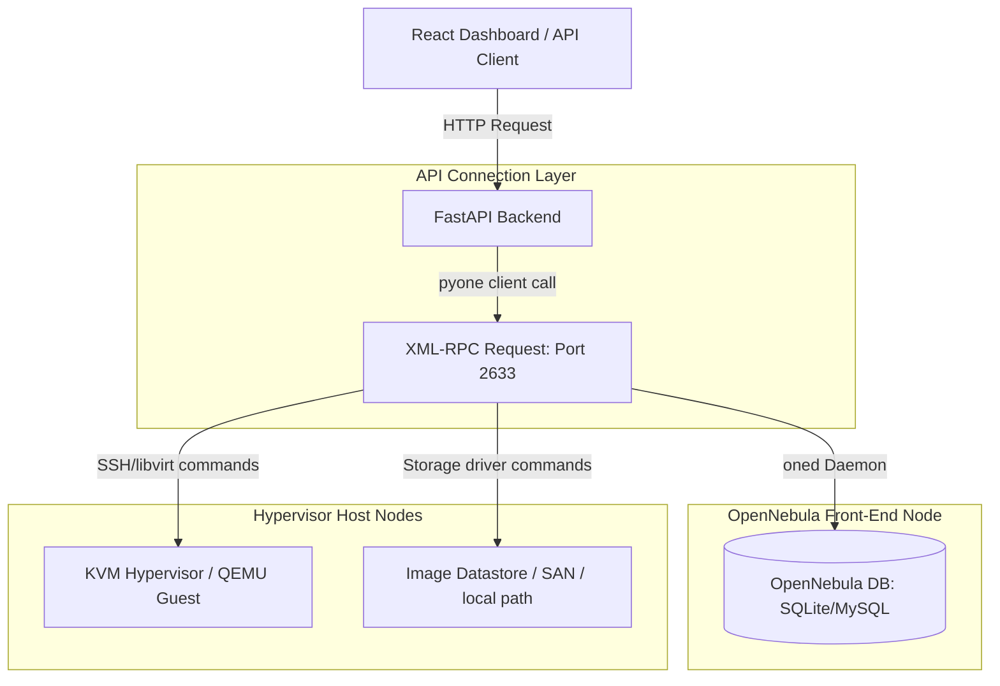
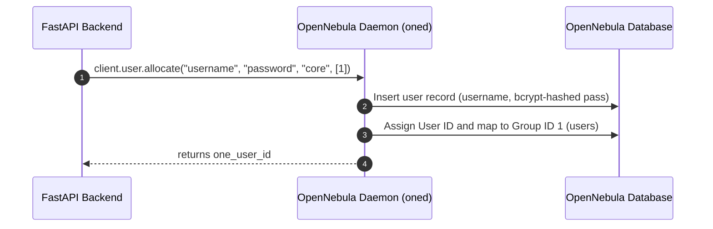
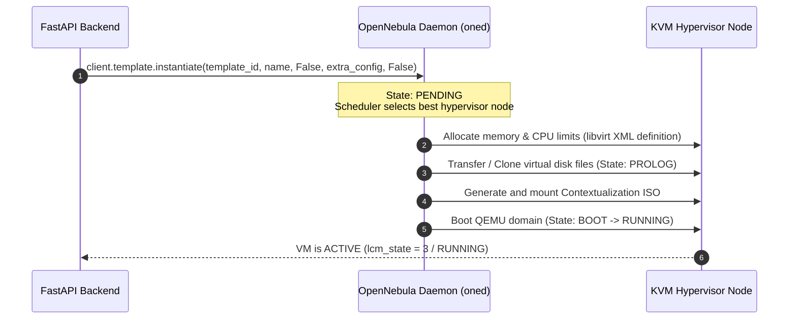
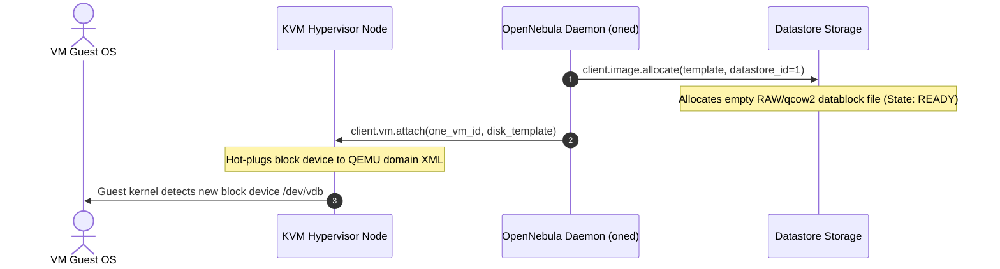

# Behind the Curtain: OpenNebula Interaction & Architecture

This guide describes how our custom cloud platform interacts with the **OpenNebula** hypervisor orchestrator behind the scenes. It explains the network protocols, low-level API calls (`pyone`), and VM state transitions that occur when actions are executed.

---

## 1. Interaction Architecture

Our FastAPI backend does not connect directly to hypervisor host nodes (KVM, QEMU) or storage datastores. Instead, it interacts exclusively with OpenNebula's core management daemon (`oned`) using the **XML-RPC protocol** on port `2633`.



### Prerequisites: Remote OpenNebula Installation (MiniOne)

To run this cloud management system, the remote server hosting the hypervisor must have OpenNebula installed and running. The easiest way to deploy a single-node testing environment is using **MiniOne**:

1. Log into your clean remote server (typically Ubuntu Server 22.04 LTS) and run:
   ```bash
   # Download the MiniOne deployment script
   wget https://raw.githubusercontent.com/OpenNebula/minione/master/minione
   
   # Deploy OpenNebula version 7.2.0, setting the admin user and password
   sudo bash minione --version 7.2.0 --username oneadmin --password your_opennebula_password
   ```
2. Once complete, the installer configures:
   * **OpenNebula core daemon (`oned`)** listening on port **`2633`** (XML-RPC).
   * **Sunstone Web UI** running on port **`80`** (or `8080`).
   * A default datastore, KVM virtualization host, and virtual network configuration.

### The XML-RPC Protocol & `pyone`
* OpenNebula exposes an XML-RPC endpoint at `/RPC2` (forwarded locally via the active SSH tunnel to `http://localhost:2633/RPC2`).
* Every API request contains the session token format `"username:password"` or `"oneadmin:password"`.
* The Python library `pyone` wraps these XML payloads into native Python methods, throwing exceptions if OpenNebula returns error codes.

---

## 2. Low-Level Flows: What Happens inside OpenNebula?

### A. User Management



*   **API call:** `client.user.allocate(username, password, "core", [1])`
*   **Behind the curtain:** OpenNebula creates a new entry in its internal database (SQLite or MySQL). It hashes the password, creates a private user group, and assigns them to the default unprivileged group `users` (Group ID 1). Future resources created by this user will be metered and isolated under this ID.

---

### B. Compute VM Provisioning & Lifecycle



#### 1. Launching a VM (`POST /compute/vms`)
*   **API call:** `client.template.instantiate(template_id, name, False, extra_config, False)`
*   **Behind the curtain:** 
    1. OpenNebula creates a database record for the new VM and sets its state to `PENDING`.
    2. **Scheduling:** The OpenNebula Scheduler (`mm_sched`) scans hypervisor nodes for CPU/RAM capacity and selects the best host node.
    3. **Disk Cloning (`PROLOG`):** OpenNebula clones the template's base OS disk image inside the datastore, creating a copy for this specific VM.
    4. **Context ISO Generation:** OpenNebula compiles an ISO image (the *Context disk*) containing network configurations, SSH public keys, and the Base64 bootstrap script.
    5. **Hypervisor Booting (`BOOT` -> `RUNNING`):** OpenNebula sends a command to the target hypervisor (via SSH or `libvirtd`) to spawn a new QEMU virtual machine, attaching the cloned OS disk, the Context ISO, and network bridge interfaces.

#### 2. Stopping a VM (`POST /compute/vms/{id}/stop`)
*   **API call:** `client.vm.action("poweroff-hard", one_vm_id)`
*   **Behind the curtain:** OpenNebula commands the host hypervisor to immediately terminate the QEMU process (`destroy` action in libvirt). The VM memory is freed, but the disk files remain unchanged. The VM state transitions to `POWEROFF`.

#### 3. Resuming a VM (`POST /compute/vms/{id}/start`)
*   **API call:** `client.vm.action("resume", one_vm_id)`
*   **Behind the curtain:** OpenNebula commands the host hypervisor to boot the VM again using its existing Libvirt XML config and persistent disk files. The VM boots and transitions to `RUNNING`.

#### 4. Terminating a VM (`DELETE /compute/vms/{id}`)
*   **API call:** `client.vm.action("terminate-hard", one_vm_id)`
*   **Behind the curtain:** OpenNebula commands the hypervisor to destroy the QEMU domain. It then purges all virtual disk files from the hypervisor storage pool and sets the VM status in the database to `DONE` (terminated).

---

### C. Block Storage (Disks)



#### 1. Creating a Disk (`POST /storage/disks`)
*   **API Call:** `client.image.allocate(template, datastore_id=1)`
*   **Behind the curtain:** OpenNebula allocates a new image record in the image datastore (Datastore ID 1). It creates an empty virtual disk file (raw or qcow2 format) on the physical disk datastore path. The image is initially `LOCKED` while the file is allocated, transitioning to `READY` once complete.

#### 2. Attaching a Disk (`POST /storage/disks/{id}/attach`)
*   **API Call:** `client.vm.attach(one_vm_id, f'DISK=[IMAGE_ID="{one_image_id}"]')`
*   **Behind the curtain:** OpenNebula locates the hypervisor node hosting the target VM. It executes a **hot-plug** command (`virsh attach-disk` or equivalent Libvirt call) to attach the datablock image to the active QEMU guest domain. The Linux kernel inside the guest VM detects a new SCSI device, mapping it as `/dev/vdb` (or `/dev/sdb`). The image state transitions to `USED`.

#### 3. Detaching a Disk (`POST /storage/disks/{id}/detach`)
*   **API Call:** `client.vm.detach(one_vm_id, disk_index)`
*   **Behind the curtain:** OpenNebula executes a **hot-unplug** command (`virsh detach-disk`) on the hypervisor host to detach the device from the QEMU domain. The VM kernel removes the block device. The image state returns to `READY`.

---

## 3. How OpenNebula Injects Code: Contextualization

When a virtual machine boots, how does OpenNebula configure its IP address, authorize your SSH keys, and install Docker automatically?

This is accomplished via **Contextualization**:

```text
+------------------------------+
| OpenNebula Frontend (oned)   |
|   - Collects IP / SSH keys   |
|   - Encodes bootstrap script |
+--------------+---------------+
               |
               v (Generates ISO Image)
+--------------+---------------+
| Virtual CD-ROM (context.iso) |
|   - context.sh               |
|   - init.sh / scripts        |
+--------------+---------------+
               |
               v (Attached to VM during boot)
+--------------+---------------+
| Guest VM (Alpine/Ubuntu)     |
|   - Mounts /dev/sr0 CD-ROM    |
|   - Runs context.sh          |
|   - Installs Docker Engine   |
+------------------------------+
```

1. **Generation:** During VM instantiation, OpenNebula builds a tiny ISO filesystem (`context.iso`) and mounts it as a virtual CD-ROM device (typically `/dev/sr0` or `/dev/vdb`) inside the VM.
2. **Context files:** The ISO contains:
   * `context.sh`: A shell script defining environmental variables such as `ETH0_IP`, `ETH0_GATEWAY`, and `SSH_PUBLIC_KEY`.
   * `START_SCRIPT_BASE64`: The Base64-encoded string containing our Docker installation routine.
3. **Execution:** On boot, the VM's built-in initialization script (provided by the `one-context` package in the base image):
   * Mounts the context CD-ROM.
   * Sources `context.sh` to configure network interfaces and append SSH keys to `~/.ssh/authorized_keys`.
   * Decodes `START_SCRIPT_BASE64` and runs it as a root startup script, installing and starting Docker automatically.

---

## 4. Hypervisor Execution (On the KVM Node)

Once the request hits the physical host, the KVM stack takes over to physically launch the process:
* **libvirtd (Libvirt Daemon):** This management daemon on the host receives the XML definition file from OpenNebula. It parses the file to understand what resources to allocate.
* **QEMU:** `libvirtd` launches a dedicated QEMU process for your specific VM. QEMU instantly allocates the virtual hardware environment, presenting virtual disks, virtual network interfaces (vNICs), and virtual chips to the guest OS.
* **KVM Kernel Module:** The QEMU process opens `/dev/kvm`. The Linux kernel uses Intel VT-x or AMD-V hardware extensions to map the VM’s virtual CPU instructions directly onto the physical CPU cores with near-zero overhead.
* **Networking (Open vSwitch / Linux Bridges):** The host's networking drivers instantly hook the VM's new virtual network interface into the pre-configured network bridge, assigning it the exact VLAN and MAC address dictated by OpenNebula.

---

## 5. Querying pools (Polling VM States)

To provide dashboard metrics, the backend queries resource pools from OpenNebula:
* **`client.vmpool.info(-2, -1, -1, -1)`**: Fetches all virtual machines. `-2` means query VMs for the current authenticated user only.
* **`client.imagepool.info(-2, -1, -1)`**: Fetches all disk images owned by the user.
* **`client.templatepool.info(-2, -1, -1)`**: Fetches all available VM OS templates.

These calls return massive XML documents. Our backend parses these XML structures, extracts relevant tags (like `<STATE>`, `<LCM_STATE>`, `<MONITORING/CPU>`, `<NIC/IP>`), and converts them to standard Python dictionaries.

---

## 6. Interview & Oral Exam Guide: VM Creation Lifecycle

If asked to explain what happens in the background when a VM is created on the platform, present the process as a **four-stage pipeline** going from the API down to the physical hypervisor:

### Stage 1: The API & XML-RPC Request
The dashboard triggers a VM creation request to our FastAPI backend. The backend uses the Python library `pyone` to send an **XML-RPC request** to the OpenNebula Frontend Daemon (`oned`) on port `2633` (forwarded via SSH tunnel). The call is `client.template.instantiate(...)`, passing the Alpine Linux template ID, user ID, VM name, and hardware overrides (CPU, memory, disk).

### Stage 2: OpenNebula Frontend Orchestration (`oned`)
Upon receiving the request, the OpenNebula daemon performs orchestrations:
1. **Registry:** It writes the VM metadata into its database (SQLite/MySQL) and sets the state to `PENDING`.
2. **Scheduling:** The OpenNebula scheduler (`mm_sched`) scans the available physical hypervisor nodes to find the one with enough CPU and RAM capacity.
3. **Disk Cloning (Prolog Phase):** OpenNebula clones the base Alpine OS image from the storage Datastore to create a dedicated disk for this new VM.
4. **Context ISO Generation:** It creates a temporary CD-ROM ISO image (`context.iso`) containing network configurations, the user's SSH keys, and the Base64-encoded docker-installation script.

### Stage 3: Physical Hypervisor Execution (KVM Stack)
Once the target host is selected, the VM is launched using the **KVM/Libvirt virtualization stack**:
1. **libvirtd (Libvirt Daemon):** Receives the virtual machine definition as an XML file from OpenNebula and parses it to allocate resources.
2. **QEMU Process:** Libvirt starts a dedicated QEMU process for our VM. QEMU emulates the virtual motherboards, virtual network interfaces (vNICs), and hooks in the cloned virtual disks.
3. **KVM Module:** QEMU opens the `/dev/kvm` device. The Linux kernel uses CPU hardware extensions (Intel VT-x or AMD-V) to map the VM's virtual CPU instructions directly onto physical cores with near-zero overhead.
4. **Bridging:** The host bridges the VM's virtual interface to the physical network bridge, assigning the MAC address and VLAN dictated by OpenNebula.

### Stage 4: Guest OS Boot & Contextualization (Code Injection)
As the VM boots up:
1. The guest OS mounts the virtual CD-ROM containing the `context.iso`.
2. The `one-context` daemon running inside the guest OS reads the configuration variables to set the IP address and inject the developer's SSH public keys into `~/.ssh/authorized_keys`.
3. Finally, it decodes our `START_SCRIPT_BASE64` string and runs it as a root script, which resolves internet connection and automatically installs and starts the Docker daemon, preparing the VM to receive containers.

