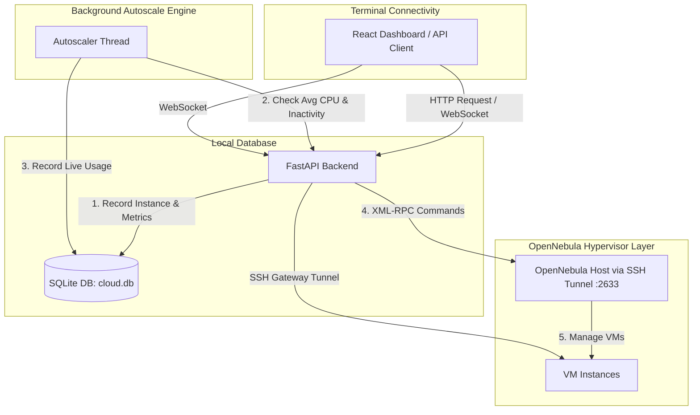
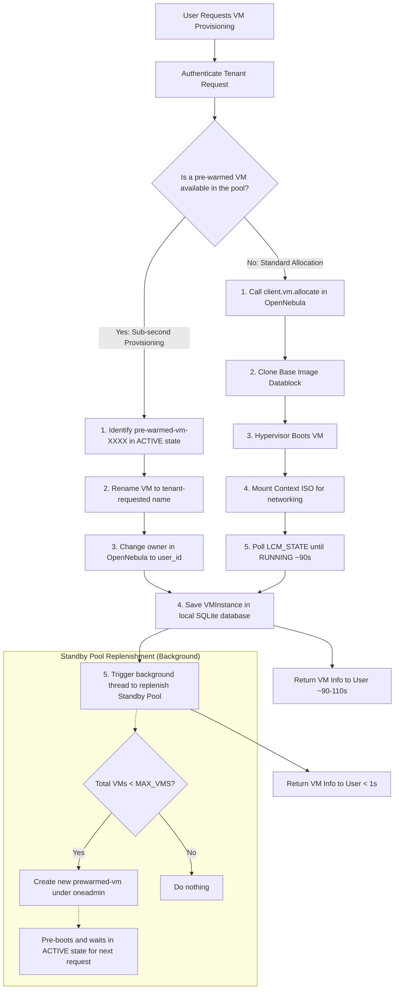
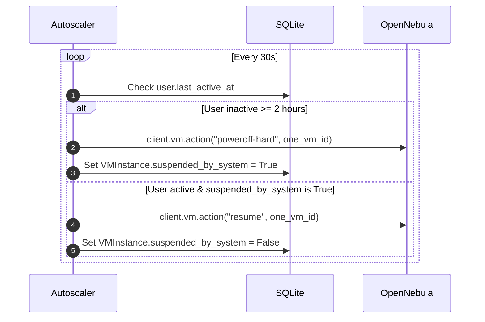
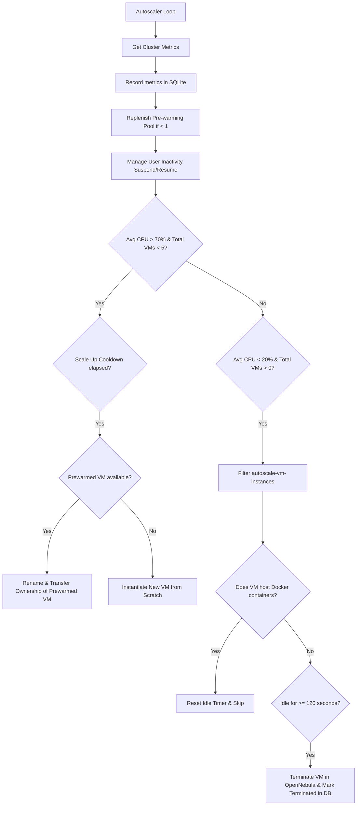
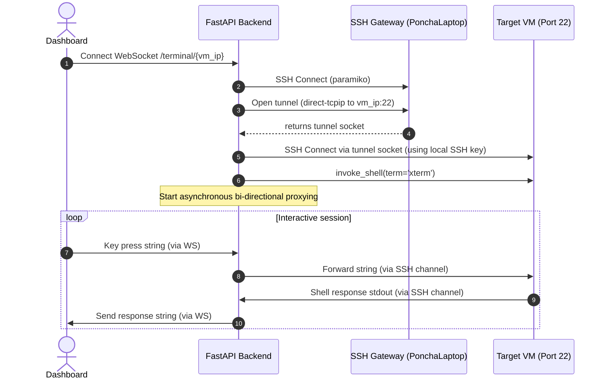

# Elastic Compute (VM) & Autoscaling Service Guide

This guide describes the architecture, configuration, operation, and testing procedures for the **Phase 3 Elastic Compute** service. This service dynamically provisions, monitors, scales, and manages OpenNebula Virtual Machines based on workload demands and user activity.

---

## 1. Architecture Overview

Rather than running static compute nodes, the compute service integrates local database tracking with OpenNebula's hypervisor layer, enabling automatic elasticity.

### Key Architectural Concepts
1. **Dynamic Provisioning:** Users can provision VMs on-demand. Local database tables (`vm_instances`) track ownership, mapping local users to OpenNebula's `one_vm_id`.
2. **Pre-Warming (Hot Standby) Pool:** To bypass the typical 1-2 minute boot latency of VMs, the system maintains at least one unassigned, fully booted VM (`prewarmed-vm-<timestamp>`) owned by the system. When a user requests a new VM or the autoscaler triggers a scale-up, the system simply renames and transfers ownership (chowns) of the standby VM to the user in OpenNebula. This drops provisioning latency to **less than 1 second**.
3. **Workload-based Autoscaling:** A background thread monitors active VMs. If average CPU utilization exceeds the scale-up threshold, it claims a prewarmed VM (or boots one from scratch). If utilization drops, it shuts down idle VMs after a cooldown window.
4. **User Inactivity Power Management (Scale to Zero):** If a user performs no API calls for 2 hours, the system suspends (powers off) their active VMs to conserve hypervisor resources. As soon as the user logs back in or queries the API, their VMs are automatically resumed.

### VM Provisioning Flowchart (Standby Pool vs. Cold Boot)

---

## 2. Low-level VM Bootstrap & Docker Provisioning

When a VM is instantiated, the backend must ensure that the Docker Engine is running so that containers and databases can be deployed on it.

During `create_vm` in [opennebula/vm_manager.py](file:///Users/angiebras/Library/CloudStorage/OneDrive-Pessoal/Ambiente%20de%20Trabalho/Mestrado/2-SEMESTRE/CLOUD/CloudInfra/CloudInfrastructure/opennebula/vm_manager.py):
1. The backend automatically injects an SSH public key from the user's OpenNebula template for secure passwordless login.
2. It detects the operating system template (Ubuntu vs. Alpine).
3. It builds a bootstrap bash/shell script that:
   * Overrides `/etc/resolv.conf` with stable DNS servers (`8.8.8.8`, `1.1.1.1`).
   * Pings `8.8.8.8` repeatedly for up to 30 seconds to wait for network availability.
   * Installs Docker (`apt-get install -y docker.io` on Ubuntu or `apk add docker` on Alpine) with up to 3 retries.
   * Enables and starts the Docker daemon service.
   * Adds the default user to the `docker` group.
4. This script is Base64-encoded and attached to the OpenNebula template context as `START_SCRIPT_BASE64` to execute automatically during the VM's early boot phase.

---

## 3. Database Schema

The compute service relies on two local tables defined in [api/compute/models.py](file:///Users/angiebras/Library/CloudStorage/OneDrive-Pessoal/Ambiente%20de%20Trabalho/Mestrado/2-SEMESTRE/CLOUD/CloudInfra/CloudInfrastructure/api/compute/models.py):

### `VMInstance` (Tracks VM ownership and state)
* **`id`**: Local unique ID.
* **`user_id`**: Foreign Key mapping to the local `User` who owns the VM.
* **`one_vm_id`**: The unique VM ID assigned by OpenNebula (source of truth for state and configurations).
* **`name`**: User-defined or autoscaler-generated name.
* **`template_id`**: OpenNebula Template ID (e.g. `0` for Alpine Linux).
* **`created_at`**: Timestamp when the VM record was created.
* **`terminated_at`**: Nullable timestamp. Set when the VM is destroyed. Retained for energy calculations.
* **`suspended_by_system`**: Boolean. True if the VM was suspended by the autoscaler due to user inactivity (used for auto-resume).

### `VMMetric` (Historical performance data for plotting)
* **`id`**: Local unique ID.
* **`vm_instance_id`**: Foreign Key referencing `VMInstance`.
* **`cpu_usage_pct`**: CPU usage percentage at recording time.
* **`memory_mb`**: RAM consumed in Megabytes.
* **`timestamp`**: Time of data capture (sampled every 30 seconds by the autoscaler).

---

## 4. Autoscaler & SLA Logic (`api/compute/autoscaler.py`)

A singleton `AutoScaler` runs on a background daemon thread, executing a check-and-scale loop every 30 seconds.

### Inactivity Suspend & Resume Flow
1. **Idle Detect:** Evaluates if a user's `last_active_at` timestamp is older than `USER_INACTIVITY_TIMEOUT_SEC` (2 hours).
2. **Action:** Suspends the user's active VMs using OpenNebula's `poweroff-hard` action and sets `suspended_by_system = True`.
3. **Resume:** If a user returns (making an authenticated API call), the autoscaler detects the activity, triggers `resume` in OpenNebula, and resets `suspended_by_system = False`.

### Scale UP & Down Workload Flow
* **Scale Up Trigger:** Average CPU across active user VMs > `SCALE_UP_CPU_PCT` (70%) AND total VMs < `MAX_VMS` (5).
  * **Claim stand-by VM:** Renames the prewarmed VM to `autoscale-vm-<timestamp>` and transfers ownership (`client.vm.chown`) to the busiest user.
  * **Cooldown:** Blocks further scale-up actions for 2 minutes to allow metrics to stabilize.
* **Scale Down Trigger:** Average CPU across active user VMs < `SCALE_DOWN_CPU_PCT` (20%) AND total VMs > `MIN_VMS` (0).
  * **Eligible VMs:** Only VMs prefixed with `autoscale-vm-` are candidates.
  * **Drain Verification:** Connects to the VM's Docker daemon via SSH (`ssh://<user>@<ip>`). If any active Docker containers are found, the VM is **not** deleted, and the idle timer resets.
  * **Idle Window:** The VM must remain idle for `SCALE_DOWN_WINDOW_SEC` (2 minutes) before it is destroyed to prevent rapid provisioning oscillation (flapping).

---

## 5. Web SSH Terminal Proxy (`api/compute/terminal.py`)

A WebSocket gateway allows users to open an interactive command terminal to their VMs directly inside the React dashboard.

### How it works:
1. **Handshake:** The dashboard opens a WebSocket connection to `ws://localhost:8000/compute/terminal/{vm_ip}`.
2. **Gateway SSH:** The API uses `paramiko` to log into the SSH Gateway (`PonchaLaptop`) defined in the environment.
3. **TCP Forwarding Tunnel:** The API requests a direct TCP forwarding channel (`direct-tcpip`) through the gateway connection to port 22 on the target VM.
4. **VM SSH:** Using the TCP tunnel socket, the API starts a second SSH client connecting to the VM. It uses the template SSH user (`root` or `ubuntu`) and verifies the session using the default private keys (`~/.ssh/id_rsa` or `~/.ssh/id_ed25519`) configured on the host.
5. **Interactive Shell:** Opens an interactive shell channel (`invoke_shell(term='xterm', width=80, height=24)`).
6. **Data Bridge:** Runs two concurrent tasks:
   * **VM-to-Web:** Reads characters from the VM stream and sends them to the browser via the WebSocket.
   * **Web-to-VM:** Listens for keystrokes on the WebSocket and sends them into the VM channel.

---

## 6. Energy and Carbon Accounting

The endpoint `GET /compute/energy-stats` calculates energy savings gained by running an elastic cluster compared to a static baseline:

1. **Uptime Calculation:** Sums the total runtime of all active and terminated user VMs:
   $$\text{Total VM Uptime} = \sum (\text{Terminated At} \text{ or } \text{Now} - \text{Created At})$$
2. **Static Baseline:** The energy cost if the maximum capacity (`MAX_VMS` = 5) had been kept running continuously since the project began:
   $$\text{Baseline Potential Hours} = (\text{Now} - \text{First VM Created At}) \times \text{MAX\_VMS}$$
3. **Hours Saved:** The net reduction in VM hours:
   $$\text{Hours Saved} = \text{Baseline Potential Hours} - \text{Total VM Hours}$$
4. **Energy Proxy metric:** Estimations based on average hypervisor hardware usage:
   * **Average Power:** 50 Watts per VM hour.
   * **Energy Saved (kWh):** $\frac{\text{Hours Saved} \times 50\text{W}}{1000}$
   * **CO2 Saved (kg):** $\text{Energy Saved (kWh)} \times 0.4\text{kg/kWh}$ (average grid CO2 emission coefficient).

---

## 7. Compute API Endpoints Reference

All compute endpoints are mounted under `/compute` inside [api/compute/router.py](file:///Users/angiebras/Library/CloudStorage/OneDrive-Pessoal/Ambiente%20de%20Trabalho/Mestrado/2-SEMESTRE/CLOUD/CloudInfra/CloudInfrastructure/api/compute/router.py).

| Method | Endpoint | Auth | Response Schema | Description |
| :--- | :--- | :--- | :--- | :--- |
| **POST** | `/compute/vms` | JWT | `VMResponse` | Provision a VM on-demand. If template is default Alpine and no overrides are requested, it claims a prewarmed VM instantly |
| **GET** | `/compute/vms` | JWT | `list[VMResponse]` | List all non-terminated VMs belonging to the current user (polls live OpenNebula states) |
| **GET** | `/compute/vms/{vm_id}`| JWT | `VMResponse` | Retrieve live CPU, memory, and status metrics for a specific VM |
| **DELETE**| `/compute/vms/{vm_id}`| JWT | *None (244)* | Terminate the VM in OpenNebula and trigger cascade cleanup of local DBaaS containers |
| **POST** | `/compute/vms/{vm_id}/start`| JWT| `VMResponse` | Resume a stopped/suspended VM |
| **POST** | `/compute/vms/{vm_id}/stop`| JWT | `VMResponse` | Power off (suspend) a running VM |
| **GET** | `/compute/status` | JWT | `ClusterStatus` | Get cluster utilization metrics, autoscaler settings, and SLA limits |
| **GET** | `/compute/vms/{vm_id}/metrics`| JWT| `list[VMMetricResponse]`| Fetch last 50 historical data points of VM CPU/memory usage for charts |
| **GET** | `/compute/energy-stats` | JWT | `EnergyStats` | Retrieve cumulative VM hours saved, kWh saved, and CO2 kg avoided |
| **POST** | `/compute/prewarm` | JWT | `{"message": "..."}` | Background task triggering container VM pre-warming |
| **GET** | `/compute/templates` | JWT | `list[TemplateResponse]`| List all virtual machine templates available in the OpenNebula system |
| **WS** | `/terminal/{vm_ip}` | Public | WebSocket channel | Connect to the interactive terminal bridge of the target VM |
