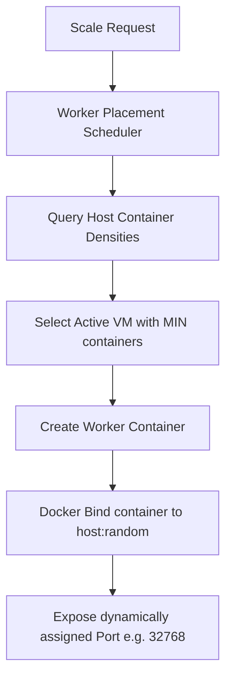
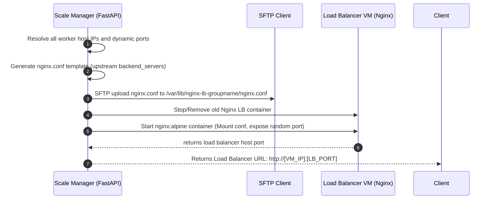
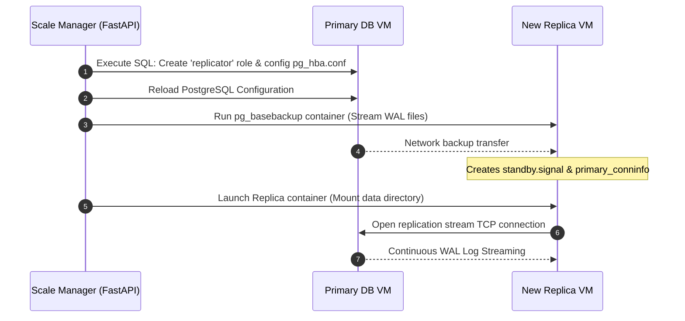
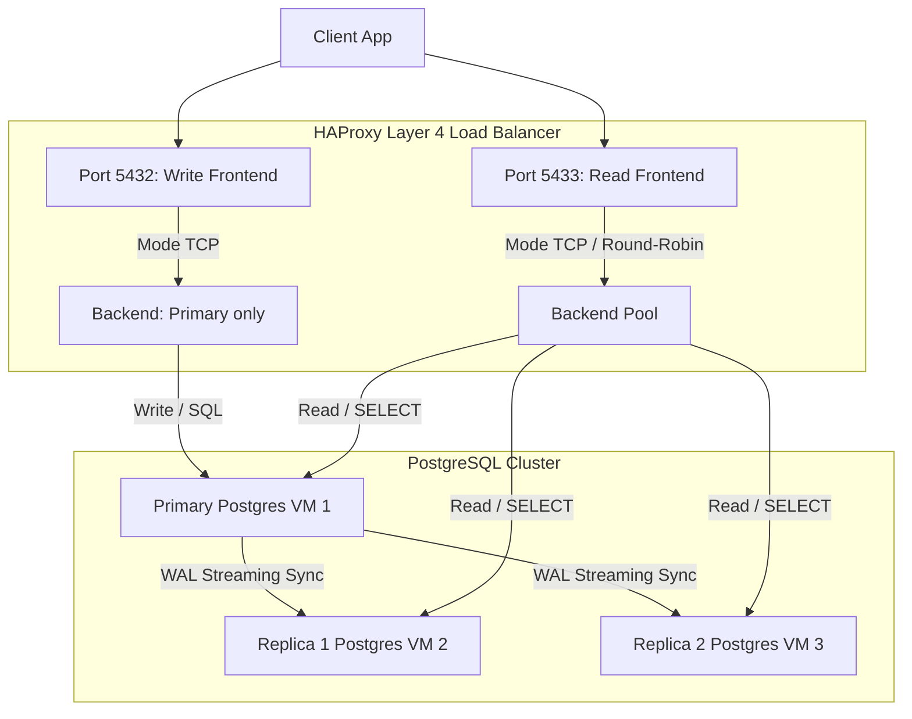
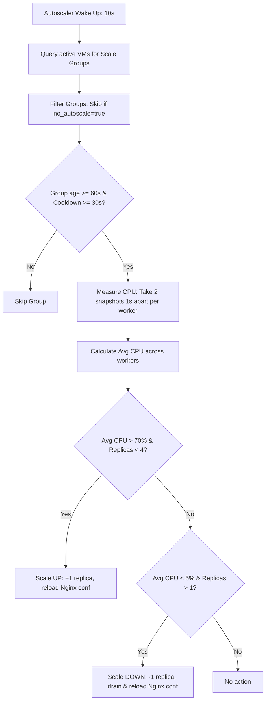

# Container Scaling & Load Balancing Architecture

This document provides a detailed breakdown of how the container scaling and dynamic HTTP load balancer features are implemented.

---

## 1. Core Concepts & Orchestration

The platform implements a stateless container orchestration layer over multiple OpenNebula Virtual Machines. Rather than tracking individual container lifecycles in an SQL database, the status is queried dynamically from Docker engines running on the VMs using Docker labels.

### Worker Containers
**Workers** are the active application containers running your code/image (e.g. `nginx:alpine`) that handle actual client workloads.

* **Identification & Isolation:** Workers are labeled with metadata for stateless tracking:
  * `cloud_user=<username>`: Restricts visibility/control to the owner.
  * `scale_group=<group_name>`: Groups multiple workers under a service name (e.g., `web-app`).
  * `role=worker`: Identifies it as a worker node instead of a proxy load balancer.
* **Auto-Placement:** When scaling up workers, the system invokes `ensure_user_has_running_vm()`, which automatically provisions or selects the active VM hosting the *fewest* total containers. This balances the workload across the VM cluster.
* **Auto-Port Mapping:** To avoid port conflicts on VM hosts (especially when multiple workers of the same service run on a single VM), the container port is mapped as:
  ```python
  ports={container_port: None}
  ```
  Docker dynamically binds it to a random free host port (e.g., `32768`). The load balancer resolves these ports dynamically and maps traffic accordingly.



---

## 2. Load Balancer Configuration (Nginx)

The load balancer directs external traffic round-robin to all worker instances.

### Nginx reverse proxy
1. **IP/Port Mapping Resolution:** The scale manager scans all active VMs, retrieves the host IP, and reads the random mapped host port of each worker container.
2. **Upstream Config Generation:** It dynamically writes a standard Nginx configuration (`nginx.conf`):
   ```nginx
   events { worker_connections 1024; }
   http {
       upstream backend_servers {
           server 172.16.100.2:32768;
           server 172.16.100.3:32815;
       }

       server {
           listen 80;
           location / {
               proxy_pass http://backend_servers;
               proxy_set_header Host $host;
               proxy_set_header X-Real-IP $remote_addr;
           }
       }
   }
   ```
3. **Configuration SFTP Upload:** The file is written to the VM hosting the load balancer at `/var/lib/nginx-lb-<group_name>/nginx.conf` via a tunneled SFTP client through the gateway.
4. **Deploying the Load Balancer Container:**
   * Stops/removes any existing load balancer container.
   * Runs an `nginx:alpine` container.
   * Mounts the configuration folder read-only.
   * Maps container port `80` to a random free host port.
   * Exposes the single load balancer address (e.g. `http://<VM_IP>:<LB_PORT>`) to the user.



---

## 3. Worker Scaling Lifecycle

* **Scale Up:** Spins up new workers, selects VM placements, handles image downloads, boots containers on dynamic ports, and regenerates the Nginx config.
* **Scale Down:** Stops and deletes excess containers starting from the newest instance, updates the Nginx upstream servers list, and reloads the proxy.
* **Scale to Zero (Cleanup):** If replicas target is set to `0`, all worker containers and the Nginx load balancer proxy are terminated.

---

## 4. Database Clustering & Replication (PostgreSQL + HAProxy)

Database clustering distributes database queries across multiple nodes while preserving data consistency:
* **Primary Instance:** Accepts both Read and Write SQL queries.
* **Replica Instances:** Accept Read-only queries (`SELECT`). They stream updates from the Primary in real-time.
* **TCP Load Balancer (HAProxy):** Exposes two ports to route queries automatically to the appropriate nodes.

### Replicas Synchronization via `pg_basebackup`
To spin up a read-replica container on a different VM, the system performs a network-based physical backup:
1. **Primary Credentials:** It connects to the Primary container and executes SQL commands to create a replication user (`replicator`) and registers replication permissions in `pg_hba.conf`, followed by a configuration reload.
2. **Dynamic Backup Container:** The system triggers a one-off backup container on the target Replica VM using a remote SSH command. This container runs `pg_basebackup` and streams all data files from the Primary IP/Port over the network directly into a local folder on the Replica VM (e.g. `/var/lib/postgresql/data-replica-i`).
3. **Replication Config generation:** The `-R` option in `pg_basebackup` creates `standby.signal` and configures the `primary_conninfo` connection string.
4. **Booting Standby:** The replica PostgreSQL container is launched, mounting the populated data directory. Since the backup created `standby.signal`, PostgreSQL automatically boots in read-only streaming replica mode.



### Real-Time Data Synchronization (WAL Streaming)
Once a replica is booted, it stays updated dynamically:
* **Write-Ahead Logging (WAL):** Every data-modifying operation on the Primary (`INSERT`, `UPDATE`, `DELETE`, table/schema changes) is written to a sequential log file known as the Write-Ahead Log (WAL).
* **Streaming Protocol:** Standby replicas maintain a persistent TCP connection to the Primary database using the `replicator` account.
* **Continuous Updates:** As WAL entries are written to disk on the Primary, they are immediately streamed to all connected standby replicas. The replicas read this stream and replay the changes in memory and on disk, mirroring data changes within milliseconds.



### Deep-Dive: HAProxy Layer 4 TCP Load Balancing
An HAProxy container (`haproxy:2.8-alpine`) is deployed on the same VM as the Primary database to route SQL connections.

#### A. Layer 4 TCP Proxying vs. Layer 7 HTTP
Unlike web traffic which is routed using HTTP headers (Layer 7), database traffic utilizes PostgreSQL's own proprietary binary protocol. Therefore, HAProxy is configured in **TCP mode (Layer 4)**. 
At Layer 4, the load balancer acts as a low-overhead stream forwarder: it establishes a TCP socket connection with the client, opens a corresponding socket to the backend database server, and pipes raw bytes back and forth without attempting to parse or validate the SQL queries.

#### B. Dual-Port Routing & Database Schema Strategy
To handle PostgreSQL operations safely, HAProxy exposes two frontends bound to different host ports. To track these two ports in the platform's metadata database:
* **Database Schema Extension:** The platform implements a self-healing schema migration on startup, adding a dedicated `read_host_port` column to the `db_instances` SQLite table.
* **Write Frontend (Port 5432):**
  * **Target Backend:** Bypasses load balancing and maps directly to the single **Primary Database** instance.
  * **Storage:** Tracked in the standard `host_port` column of the SQLite DB.
  * **Purpose:** Ensures all state-modifying actions (`INSERT`, `UPDATE`, `DELETE`, schema modifications) are only executed on the primary database, avoiding data divergence and split-brain issues.
* **Read Frontend (Port 5433):**
  * **Target Backend:** Distributes traffic round-robin across a pool containing **both the Primary database and all Standby replicas**.
  * **Storage:** Tracked in the dedicated `read_host_port` column of the SQLite DB.
  * **Purpose:** Distributes heavy-read workloads (`SELECT` operations, analytical reports) evenly across all active VMs, preventing any single VM from becoming a bottleneck.

> [!IMPORTANT]
> **Developer Query Splitting Requirement:** Because HAProxy operates as a Layer 4 TCP proxy, it cannot parse SQL strings to separate writes from reads automatically. Application developers must handle this in their code by setting up two separate database connection engines:
> * Route all writes (`INSERT`, `UPDATE`, `DELETE`, DDL) to the Primary port (mapped to HAProxy `5432`).
> * Route all read-only queries (`SELECT`) to the replica load balancer port (mapped to HAProxy `5433`).


#### C. Database Health Checking (`option tcp-check`)
To guarantee high availability, HAProxy monitors backend database health using active TCP probes:
* The configuration directive `option tcp-check` instructs HAProxy to open a TCP connection to each backend database port at regular intervals.
* If a database replica container crashes or its host VM is suspended by the autoscaler's energy-saving logic, HAProxy fails to open the TCP port.
* HAProxy immediately marks that replica as `DOWN` and dynamically stops routing incoming read requests to it.
* Once the replica wakes up and its PostgreSQL port becomes reachable, HAProxy automatically marks it as `UP` and resumes routing connections.

#### D. Dynamic Config Generator & Hot Reloading (SIGHUP)
When you scale the database cluster (via the `/databases/cluster/{cluster_name}/scale` endpoint), the platform performs a hot configuration reload:
1. **Config Generation:** The system regenerates the configuration file (`haproxy.cfg`) with the current active IPs and mapped host ports of all replicas in the cluster.
2. **Writing Configuration:** The system uploads the configuration file directly to `/var/lib/haproxy-{cluster_name}/haproxy.cfg` on the load balancer host.
3. **Signal Trigger (SIGHUP):** The backend triggers a hot reload of HAProxy using the following Docker signal:
   ```bash
   docker kill -s HUP <haproxy_container_name>
   ```
4. **Zero-Downtime Transition:** The `SIGHUP` signal tells the HAProxy master process to spawn new worker threads to handle fresh connections using the new configuration, while keeping the old threads alive to drain existing active queries. This ensures that scaling operations never drop active connections.

#### E. Memory & Concurrency Optimization
In constrained environment VMs (e.g., 218MB RAM), the default HAProxy container initialization can exceed the memory footprint. To run HAProxy reliably without Out-Of-Memory (OOM) kills, the template implements memory and concurrency limit directives:
*   `nbthread 1`: Caps HAProxy to a single worker thread instead of multi-threading.
*   `maxconn 100` / `maxconn 50`: Caps maximum concurrent connections globally and in defaults, capping memory footprint at roughly **~15MB RSS** (down from ~57MB).

#### F. Safe Connection Initialization (`pg_isready`)
When database clusters are provisioned, there is a delay before the primary container starts accepting socket queries. Attempting to create the `replicator` role or update configurations immediately causes silent database query failure.
To avoid this race condition, the system runs a polling loop using the PostgreSQL tool `pg_isready` to block progress until the database is fully ready to accept connections before running setup commands.

#### G. Self-Healing Dynamic Port Synchronization on Container Restart
In a cloud environment where database containers use dynamic host port bindings, restarting a container can cause Docker to assign a new random port on the VM host. To prevent this from breaking connectivity or leaving stale port records:
* **Port Auto-Recovery:** Upon triggering a container restart, the platform automatically queries the Docker engine on the target VM to retrieve the newly assigned host ports (both the standard port and read-only port).
* **Metadata Sync:** The database schema updates these new port numbers in the SQLite metadata storage (`cloud.db`) automatically.
* **Credentials Sync:** The load balancer configuration is updated to map database connections using the correct active credentials, preventing blank-password or wrong-port failures.

#### H. Sample Configuration File (`haproxy.cfg`)
```haproxy
global
    log stdout format raw local0
    nbthread 1
    maxconn 100

defaults
    log     global
    mode    tcp
    maxconn 50
    timeout connect 5s
    timeout client  50s
    timeout server  50s

frontend postgres_write_front
    bind *:5432
    default_backend postgres_primary

backend postgres_primary
    mode tcp
    option tcp-check
    server db-primary 172.16.100.2:32768 check

frontend postgres_read_front
    bind *:5433
    default_backend postgres_replicas

backend postgres_replicas
    mode tcp
    balance roundrobin
    option tcp-check
    server db-primary 172.16.100.2:32768 check
    server db-replica-1 172.16.100.3:32801 check
    server db-replica-2 172.16.100.4:32815 check
```

---

## 5. Native Container Autoscaling

The platform features a **native background autoscaler** that automatically adjusts container worker group replicas based on real-time traffic load.

### Daemon Architecture
* **FastAPI Lifespan Hooks:** The autoscaling daemon runs as a native background thread (`ContainerAutoScaler`) managed by the FastAPI server's lifespan context. It starts when the web application boots and is gracefully stopped upon server shutdown.
* **Periodic Checking:** The scaler checks metrics every **`10 seconds`**.
* **Dynamic Discovery (Stateless):** Rather than keeping scale configuration in a database, the scaler queries the running VMs dynamically. It discovers all container groups by identifying containers with the labels `scale_group=<group_name>` and `role=worker`.
* **Target Isolation:** The scaling is completely tenant-isolated. It extracts the container owner from the label `cloud_user=<username>` and targets scaling operations specifically to that tenant's workspace.
* **Opt-Out Label:** Any scale group can be excluded from autoscaling by setting the label `no_autoscale=true` on its worker containers. The scaler will discover the group but silently skip it every cycle.

### CPU Measurement — Two-Snapshot Method
The Docker stats API's single-snapshot mode (`stream=False`) returns a stale `precpu_stats` baseline, causing CPU to always read as `0.0%` on idle containers. The autoscaler fixes this by **taking two explicit snapshots 1 second apart** and computing the delta:

```python
s1 = container.stats(stream=False)
time.sleep(1)
s2 = container.stats(stream=False)

cpu_delta    = s2["cpu_stats"]["cpu_usage"]["total_usage"]  - s1["cpu_stats"]["cpu_usage"]["total_usage"]
system_delta = s2["cpu_stats"]["system_cpu_usage"]          - s1["cpu_stats"]["system_cpu_usage"]
cpu_pct      = (cpu_delta / system_delta) * online_cpus * 100
```

This guarantees a real measurement interval and accurate CPU readings even on containers with very low or burst load.

### Metrics & Scaling Rules
1. **CPU Tracking:** For each worker container in the group, the daemon opens a temporary Docker SSH connection to the host VM, takes the 2-sample CPU measurement, and closes the connection immediately to release socket resources.
2. **Average Workload Evaluation:** It computes the **average CPU percentage** across all active (running) workers in the scale group. Stopped or errored containers contribute `0.0%`.
3. **Scaling Parameters:**

   | Parameter | Value | Description |
   |:---|:---|:---|
   | Check interval | `10s` | How often the daemon wakes and evaluates every group |
   | Scale-up threshold | `70%` avg CPU | Adds `+1` replica if average CPU exceeds this |
   | Scale-down threshold | `5%` avg CPU | Removes `−1` replica if average CPU falls below this |
   | Min replicas | `1` | Floor — the autoscaler will never scale below this |
   | Max replicas | `4` | Ceiling — the autoscaler will never scale above this |
   | Cooldown | `30s` | Minimum wait between any two scaling actions for a group |
   | Stabilization window | `60s` | Newly-discovered groups skip scaling for 60 seconds after first detection, preventing premature scale-down when containers first boot at 0% CPU (mirrors Kubernetes HPA stabilization) |

### Scaling Decision Flow (per check cycle)



---

## 6. API Endpoints Reference (FastAPI Router)

The load balancer features are exposed under the `/loadbalancer` prefix in [router.py](file:///Users/angiebras/Library/CloudStorage/OneDrive-Pessoal/Ambiente%20de%20Trabalho/Mestrado/2-SEMESTRE/CLOUD/CloudInfra/CloudInfrastructure/api/loadbalancer/router.py):

| Method | Endpoint | Request Body | Description |
| :--- | :--- | :--- | :--- |
| **POST** | `/loadbalancer/containers/scale` | `ContainerScaleRequest` | Scale generic workers up/down and provision Nginx HTTP proxy |
| **GET** | `/loadbalancer/containers/scale/{name}` | *None* | Retrieve container group and Nginx load balancer details |
| **POST** | `/loadbalancer/databases/cluster` | `DBClusterProvisionRequest` | Provision Primary + Standby Replicas + HAProxy Load Balancer |
| **POST** | `/loadbalancer/databases/cluster/{cluster_name}/scale` | `replicas` (Query Param) | Scale read-replicas count and gracefully reload HAProxy config |
| **GET** | `/loadbalancer/databases/cluster/{cluster_name}` | *None* | Retrieve DB cluster status, replica health, and HAProxy ports |
| **DELETE** | `/loadbalancer/databases/cluster/{cluster_name}` | *None* | Terminate and clean up all primary, replica, and HAProxy containers, delete their data/config directories on the VMs, and purge SQLite database records |

---

## 7. How to Test

Three integration and verification options are available:

### A. General Verification Script
Runs end-to-end Nginx container scaling, database cluster provisioning, and replica scaling:
1. Start your local FastAPI backend server:
   ```bash
   uvicorn api.main:app --port 8000 --reload
   ```
2. Execute the verification test:
   ```bash
   python scripts/test_load_balancing.py
   ```

### B. HAProxy Load Balancing & Replication Script
Performs a write query through the HAProxy write port, checks replication directly on replicas, and tests round-robin distribution by querying the HAProxy read port in a loop:
1. Execute the HAProxy verification test:
   ```bash
   python scripts/test_haproxy.py
   ```

### C. Container Load Balancing Connection Routing Script
Verifies HTTP traffic round-robin distribution by modifying `index.html` files inside Nginx worker containers and executing test queries on the load balancer VM via SSH:
1. Execute the verification test:
   ```bash
   PYTHONPATH=. python scripts/test_http_lb_routing.py
   ```

### D. Autoscaler End-to-End Verification Script
Runs a full scale-up → scale-down lifecycle test against the native container autoscaler:

* **Phase 1 (Scale-UP):** Provisions 2 `nginx:alpine` workers (autoscale enabled), configures gzip compression on a 5 MB test file, then floods the load balancer with 25 concurrent `curl` loops for 90 seconds. The autoscaler should detect `avg_cpu > 70%` and add a 3rd replica.
* **Phase 2 (Scale-DOWN):** Flood stops, CPU drops. The autoscaler should detect `avg_cpu < 5%` and remove the extra replica within 90 seconds.

> [!IMPORTANT]
> The API server (`uvicorn`) **must be restarted** before running this test. The two-snapshot CPU fix is only active after a server restart with the updated code.

1. Start (or restart) the API server:
   ```bash
   uvicorn api.main:app --port 8000 --reload
   ```
2. Run the autoscaler test:
   ```bash
   PYTHONPATH=. python scripts/test_autoscaler.py
   ```
3. Expected output:
   ```
   Scale-UP   (avg CPU >70% → new replica): ✅ PASS
   Scale-DOWN (avg CPU <5%  → drop replica): ✅ PASS
   Peak replicas seen: 3
   ```
4. If scale-up fails, check the uvicorn server logs for lines like:
   ```
   ContainerAutoscale monitor for 'autoscale-test' ... avg_cpu=X.X%
   ```
   If `avg_cpu=0.0%`, the server was not restarted and is still using the old single-snapshot code.

### E. Resource Cleanup
Because database clusters are left running after tests for inspection, you can clean up all database cluster containers, data/config directories on the VMs, and SQLite database records using any of the following methods:

1. **Via the dashboard**: Click the **Delete Cluster** button next to the primary or load balancer row in the Databases tab.
2. **Via the API**: Send a `DELETE` request to the cluster endpoint:
   ```bash
   curl -X DELETE http://localhost:8000/loadbalancer/databases/cluster/{cluster_name} -H "Authorization: Bearer <token>"
   ```
3. **Via the cleanup script**:
   ```bash
   PYTHONPATH=. python scripts/cleanup_db_cluster.py
   ```

---

## 8. Why There is No Database Autoscaler

The container autoscaler ([`container_autoscaler.py`](file:///Users/angiebras/Library/CloudStorage/OneDrive-Pessoal/Ambiente%20de%20Trabalho/Mestrado/2-SEMESTRE/CLOUD/CloudInfra/CloudInfrastructure/api/loadbalancer/container_autoscaler.py)) runs as a background daemon and scales container workers automatically. A natural question is: **why doesn't the same pattern exist for database replicas?**

The answer comes down to the fundamental cost difference between the two scaling operations.

### The Core Problem — `pg_basebackup` is O(database size)

When this platform adds a new read replica, it runs `pg_basebackup` against the live primary:

```bash
pg_basebackup -h primary_ip -p port -D /backup -U replicator -R
```

This **streams the entire database, byte by byte, from the live primary**. For any non-trivial database size this is:

| Database size | Approximate backup time | Primary impact |
|:---|:---|:---|
| 100 MB (this project) | ~5–10 seconds | Minimal |
| 10 GB | ~5–15 minutes | Noticeable I/O spike |
| 100 GB | ~1–2 hours | Significant load on primary |
| 500 GB | ~4–8+ hours | Severe — can degrade production traffic |

Triggering this automatically in response to a load spike would **make the problem worse**, not better:

```
DB gets busy
  → autoscaler fires pg_basebackup
    → primary forced checkpoint + full disk read starts
      → primary becomes even busier
        → existing queries slow down further
          → load stays high for hours while backup runs
```

### Why the Container Autoscaler is Safe

Spinning up a new `nginx:alpine` worker takes **3–5 seconds** and has zero impact on existing workers. The cooldown and stabilization windows (30 s and 60 s respectively) are sufficient to prevent thrashing.

For database replicas, even a 10-minute cooldown would be insufficient — the backup operation itself might still be running when the cooldown expires.

### How Real Cloud Platforms Solve This (GCP, AWS, Azure)

Production managed database services never copy data from the live primary when adding a replica. Instead, they use **continuous WAL archiving to object storage**:

1. The primary **continuously ships WAL segments** to object storage (e.g. Google Cloud Storage, S3) in the background — this is always happening, regardless of whether you intend to create a replica.
2. When a new replica is needed, the platform **restores the most recent automated snapshot** from object storage onto a new disk. This does not touch the primary at all.
3. The new replica **replays only the WAL delta** (the changes since the snapshot) to catch up to the present — a small, bounded amount of data.
4. The replica then connects as a streaming standby for ongoing changes.

Some platforms (Google AlloyDB, Amazon Aurora) go further and use a **shared distributed storage layer** — all nodes read from the same underlying storage, so adding a read replica is purely a compute operation (seconds) with no data movement at all.

### Design Decision — Manual Scaling Only

Because this platform uses `pg_basebackup`-based replication, database scaling is kept as a **deliberate, user-triggered action**:

```
User decides → POST /loadbalancer/databases/cluster/{name}/scale?replicas=2
```

This is the correct design for this architecture. The user consciously pays the cost of the backup at a time of their choosing — not automatically during a load spike when the primary can least afford it.

> [!NOTE]
> A read-only **monitoring daemon** (`db_monitor.py`) could be added in future to track connection counts and replication lag and emit warnings when thresholds are exceeded — without ever triggering a scale action automatically. This would provide observability without the operational risk.


